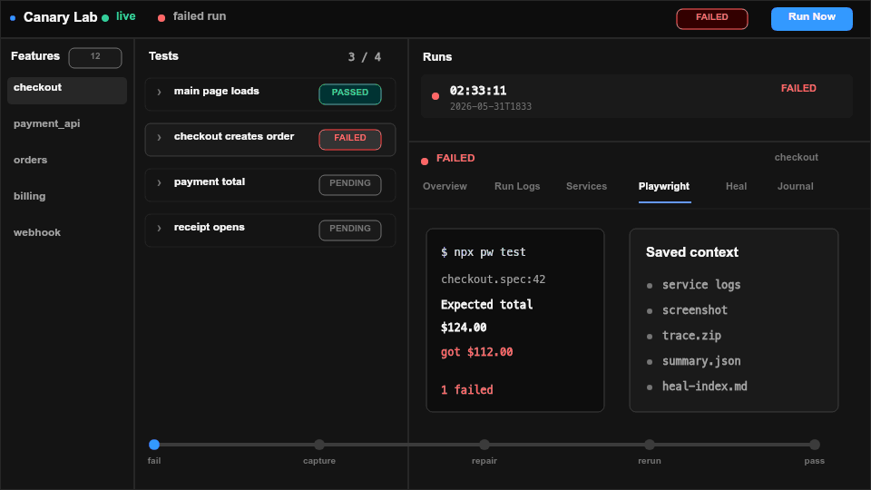
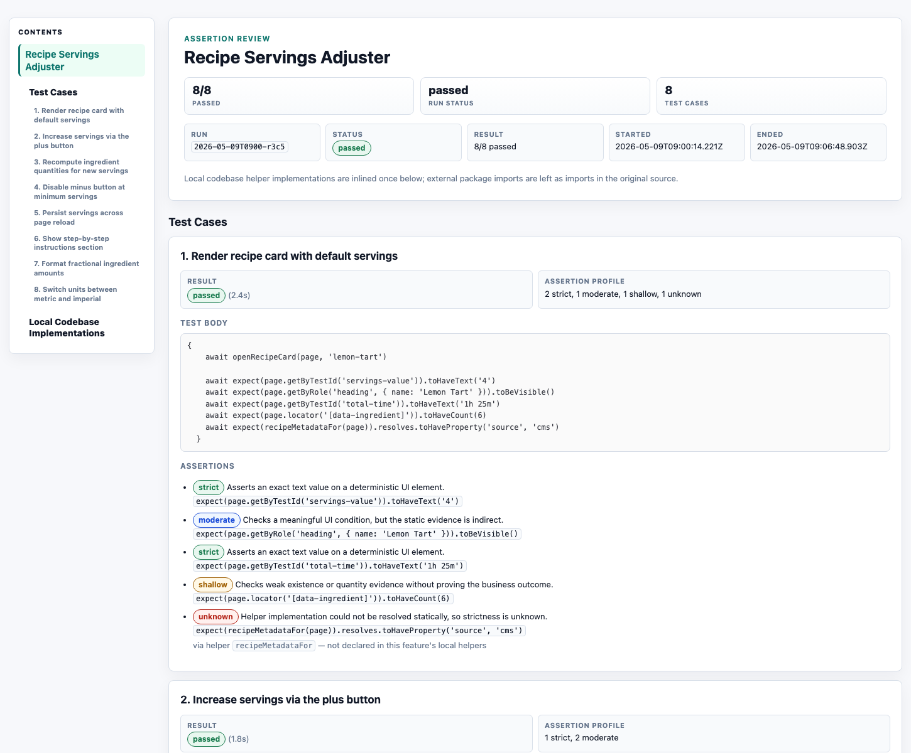
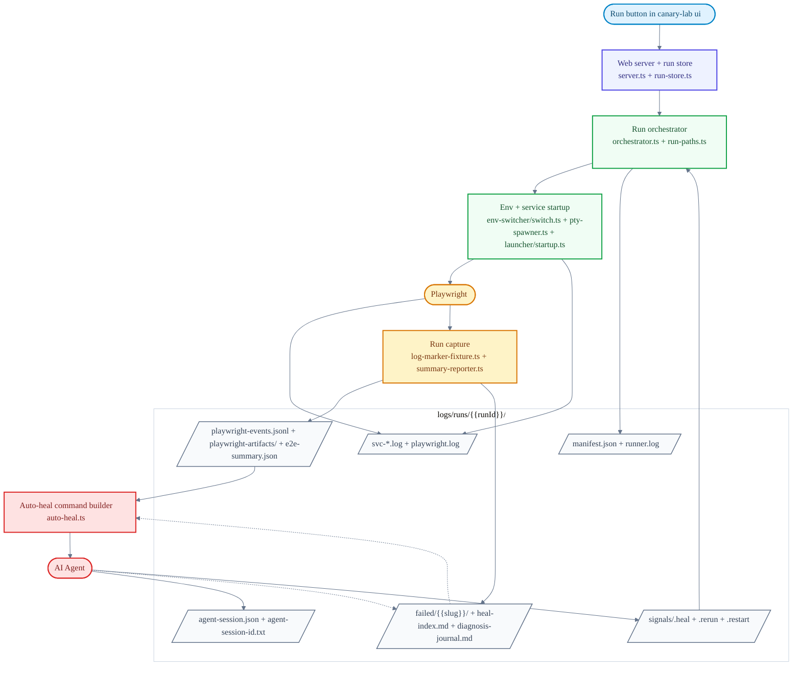

# Canary Lab

[](https://www.npmjs.com/package/canary-lab)
[](LICENSE)

The AI repair loop for Playwright.

Canary Lab runs your local Playwright tests, captures the evidence around each failure, and gives Codex, Claude, or another MCP client the context it needs to fix the app and rerun the check.

It is built for teams using tests as the spec. A failed test should leave behind enough context for the next engineer or AI agent to understand what broke, change the right code, and continue from the same run instead of digging through terminal scrollback.



## Repair Loop

1. Canary Lab starts your local services and applies the selected envset.
2. Playwright runs the feature tests.
3. Logs, screenshots, traces, videos, summaries, and failure slices are saved under `logs/runs/<runId>/`.
4. Codex, Claude, or another MCP client reads the failure context.
5. The agent fixes the app or test and signals `rerun` or `restart`.
6. Canary Lab continues from the same run until the check passes.

See [CHANGELOG.md](CHANGELOG.md) for release notes.

## Quick Start

Create a Canary Lab workspace and open the local UI:

```bash
npx canary-lab init my-lab
cd my-lab
npm install
npm run install:browsers
npx canary-lab setup
npx canary-lab ui
```

This creates a workspace with sample features, installs Playwright browsers, registers AI Agent tools, and opens the UI at `http://localhost:7421`.

To start the UI without opening a browser:

```bash
npx canary-lab ui --no-open
```

After `canary-lab setup`, restart your AI Agent so it can discover the Canary Lab tools. If the tools do not show up, refresh setup and start a fresh agent session:

```bash
npx canary-lab setup --force
```

## Agent-First Workflow

Starting from **v1.1.0**, Canary Lab is built for an agent-first workflow. An AI Agent or another MCP client can write tests, start or claim runs, read failure context, make fixes, and signal the next runner action.

Canary Lab stays the local run monitor and source of truth for evidence. The agent remains the place where instructions, diagnosis, and code changes happen.

Then ask from the same workspace:

```text
/canary-lab run checkout locally, fix it if it fails, and run it again until it passes
```

The typical repair loop:

1. Implement the feature.
2. Add Playwright coverage under a Canary Lab feature folder.
3. Start or claim the run through MCP. Custom clients can use the local HTTP API, and humans can start runs from the UI.
4. Canary Lab applies the selected envset, starts services, runs Playwright, and records logs, screenshots, traces, videos, summaries, and failure slices.
5. On failure, the agent reads the saved context, fixes the app or test, writes a diagnosis note, and signals `rerun` or `restart`.
6. After the run passes, export an evaluation report when review evidence is needed.

## What Canary Lab Owns

Canary Lab has a narrow boundary. It does not define a new test language, assertion model, or browser runner. Engineers and agents write normal Playwright tests, and Playwright still executes them.

Canary Lab handles the run context around Playwright:

- Feature folder structure and scaffold conventions.
- Envset application and cleanup.
- Service startup, health checks, PTY streams, and shutdown.
- Run manifests, lifecycle events, logs, and retained artifacts.
- Failure slices, summaries, diagnosis journals, and agent handoff prompts.
- Rerun and restart signals after a fix.

The goal is explicit run state. A failed Playwright run should leave enough context for the next human or agent to inspect what happened, change the app or test, and continue without reconstructing the failure from terminal output.

## Why Not Just Playwright?

Use plain Playwright when one command gives you enough context. Use Canary Lab when a failure depends on more than a browser assertion: which services were running, which env files were active, what the backend logged, and which screenshots, traces, or videos were produced.

Canary Lab keeps Playwright visible, then adds the local orchestration and failure handoff needed to repair a failed run.

## Common Use Cases

- **Multi-service local apps:** start a frontend, API, worker, and dependent service together, then keep each service log attached to the Playwright run that used it.
- **Environment switching:** run the same feature against `local`, `staging`, or `production` envsets without hand-editing `.env` files before and after each run.
- **Agent repair from saved evidence:** give the AI Agent the failure slice, Playwright summary, screenshots, traces, service logs, and diagnosis journal, then let it signal `rerun` or `restart` after a fix.

## Use It When

- You want to run e2e tests and have the AI Agent fix the application code when they fail.
- You want logs, screenshots, traces, videos, summaries, and diagnosis notes saved per run.
- You want repairs based on saved run context instead of terminal scrollback.
- You need repeatable reruns with explicit env and service cleanup.

Canary Lab is likely unnecessary if:

- A plain `npx playwright test` command gives you enough context.
- You want tests that update themselves when the UI changes (self-healing locators).
- You do not need service orchestration, env switching, or retained local run history.
- You want a hosted dashboard that manages tests for you.

## Current Scope

- Local UI server on `http://localhost:7421`.
- Local service orchestration through `node-pty`.
- Node.js >= 20 and npm >= 9.
- Modern browser: Chrome, Firefox, or Safari.
- Optional repair agents: supported agent CLIs (`claude` or `codex`) on `PATH`.

## Feature Folders

A feature lives under `features/<name>/` and contains:

- `feature.config.cjs`
- Playwright config
- Playwright specs under `e2e/`
- envsets under `envsets/`

Create a feature from the UI or with:

```bash
npx canary-lab new feature checkout-discounts --description "Validate checkout discounts"
```

The UI also has an Add Test flow that can turn a PRD or uploaded document into a generated plan and Playwright files for review. Generated tests still run through Playwright.

## Commands

```bash
npx canary-lab init <folder>
npx canary-lab setup
npx canary-lab ui
npx canary-lab mcp [--profile repair|verify|author|full]
npx canary-lab mcp doctor [--profile repair|verify|author|full]
npx canary-lab new feature <name> --description "..."
npx canary-lab env apply <feature> <set>
npx canary-lab env revert <feature>
npx canary-lab upgrade
```

Notes:

- `ui` is the primary human workflow.
- `setup` refreshes the agent/tool registration described in Quick Start.
- `mcp` bridges local AI clients into the UI server. If the default local server is down, the bridge starts `canary-lab ui --no-open`, waits for `/mcp/health`, then exposes tools. It defaults to `repair`; use `--profile verify` for deployment checks, `--profile author` for feature/test/evaluation authoring, or `--profile full` for the complete low-level surface.
- `new feature` and `env` are deterministic wrappers for scripts and agents.
- `upgrade` syncs scaffolded docs and skills in an existing project. It is not a dependency upgrade command.

## Environment Switching

Envsets are temporary environment files for a feature. During a run, Canary Lab backs up the target files, applies the selected envset, and restores the originals when the run ends.

Use the Envsets tab to create an env, add files, edit values, and start a run. Envsets live under:

```text
features/<feature>/envsets/
```

Feature configs can make service startup env-specific. For example, a `local` env can start services, while a `production` env can skip local startup and point tests at a deployed URL.

External clients should use the installed Canary Lab agent skill and MCP author tools for env capture. The old project-local AI Agent env-import skill files are no longer scaffolded.

### Environment Variable Safety

Envset files often contain credentials copied from local app configs. The default `.gitignore` ignores `features/*/envsets/*/*` so value files are not committed by accident. If you override this or use `git add -f`, review the files before pushing.

## Run Output

Each run writes to:

```text
logs/runs/<runId>/
```

Key files and folders:

- `manifest.json`: run metadata, feature, services, repo snapshots, artifact policy, and signal paths
- `runner.log`: orchestration events
- `lifecycle-events.jsonl`: UI lifecycle events
- `svc-*.log`: service stdout and stderr
- `playwright.log`: raw Playwright output
- `playwright-events.jsonl`: structured test and browser-action events
- `playwright-artifacts/`: retained screenshots, videos, traces, and attachments
- `playwright-artifacts-keep/`: artifact snapshots kept across targeted reruns
- `e2e-summary.json`: current test state and failure context
- `failed/<slug>/`: per-failure context slices
- `heal-index.md`: compact failure index for repair
- `diagnosis-journal.md`: heal-cycle notes and outcomes
- `agent-session.json` and `agent-session-id.txt`: agent replay pointers for auto-heal
- `signals/`: `.heal`, `.rerun`, and `.restart`

`logs/runs/index.json` tracks run history. Run detail pages and MCP flows resolve artifacts by run id under `logs/runs/<runId>/`.

## Evaluation Report

Completed runs can export an Evaluation Report from the run detail Overview tab. The download is a `.zip` containing `evaluation.html` and captured videos.



The report summarizes what was tested, the result, and the evidence. Each test case can expand to show its flowchart, test code, helper code, videos, and checks.

## Agent Repair Workflow

When a Playwright test fails, an external client can claim the run over MCP, fetch run-scoped context, fix the app or test, and signal the next runner action:

- `signal_run` with `kind: "restart"` for service or app changes
- `signal_run` with `kind: "rerun"` for test or config-only changes

### Auto-Heal

Auto-heal starts a supported agent CLI in a PTY tab when a run fails. Canary Lab renders `apps/web-server/prompts/heal-agent.md` with the active run paths and passes it to the agent.

Auto-heal stops when tests pass, the user stops the run, the agent exits without a useful signal, a cycle times out, or no supported CLI is available.

### Manual Heal

Manual repair uses the run-scoped context in the UI or MCP response. A failing run waits for a signal file under its run directory.

1. Open the failed run in Canary Lab.
2. Read the run's `heal-index.md`, failure slices, and `diagnosis-journal.md`.
3. Write `logs/runs/<runId>/signals/.restart` or `logs/runs/<runId>/signals/.rerun`.

MCP clients should prefer compact `get_heal_context`, `wait_for_heal_task`, and `signal_run` instead of writing signal files directly. Use `get_run_snapshot` only when the compact context is not enough and the agent needs verbose summaries, full count lists, or deeper debugging fields.

If a running AI Agent session says Canary Lab tools are unavailable, follow **Refresh Agent Tools** and start a fresh client session. MCP tools are discovered by the client session; the local HTTP API is only a fallback for custom clients or emergency debugging.

## External Authoring Workflow

External AI Agent clients can use the MCP `author` profile to create durable Canary Lab tasks without asking Canary Lab to author content:

1. Call `create_feature` to scaffold `feature.config.cjs`, `playwright.config.ts`, and `envsets/`.
2. Call `capture_feature_env_files` for existing `.env`, `.env.dev`, or `application.properties` files. Responses show redacted key names only.
3. Author Playwright specs in the external client, then call `start_external_draft`, `update_external_draft_stage`, and `apply_external_draft`.
4. Run or verify the feature. After tests pass, call `start_external_evaluation_export`, generate the report in the external client, and submit it with `submit_external_evaluation_export`.

The UI marks these tasks as generated by an external client. It stores stages, session names, and downloadable artifacts, but it does not show or replay the external client transcript.

### Repair Context

For repairs, agents should start from:

- `get_heal_context` for the compact current-failure handoff packet
- `get_run_snapshot` only as the verbose fallback
- `logs/runs/<runId>/heal-index.md`
- `logs/runs/<runId>/failed/<slug>/`
- `logs/runs/<runId>/e2e-summary.json`
- `logs/runs/<runId>/playwright-events.jsonl`
- `logs/runs/<runId>/diagnosis-journal.md`
- `logs/runs/<runId>/signals/.rerun`
- `logs/runs/<runId>/signals/.restart`

## Limitations

- Repairs depend on useful service logs.
- Envset runs overwrite target files while active. If the process is killed during backup or restore, reopen the UI and use the envset controls to recover.
- Envset values are not validated. Stale config can cause unclear test failures.
- The Linux and Windows workflows are not polished yet.

## Runtime Model

A run starts from the UI, MCP bridge, or local HTTP API. Canary Lab starts services, waits for health checks, runs Playwright, writes artifacts, and shows the result in the UI. Failed runs can enter manual heal or auto-heal. The next Playwright pass is triggered by MCP `signal_run` or by `.rerun` / `.restart` signal files.

## For Contributors

### Code Orientation

- `server.ts`: local Fastify app, UI assets, routes, and WebSocket streams
- `orchestrator.ts`: service startup, health checks, Playwright runs, manifests, envset cleanup, and heal-loop signals
- `run-store.ts`: per-run manifests, summaries, Playwright events, and artifacts for the UI
- `env-switcher/switch.ts`: low-level env-file apply and revert logic
- `feature-support/`: public import surface for generated projects

Everything under `apps/`, `scripts/`, and `shared/` is internal unless exposed through `canary-lab/feature-support/...`.

### Run Architecture

This diagram shows the code path for a run started from `canary-lab ui`.



### Local Development

```bash
npm install
npm run build
```

### Repository Layout

- `scripts/`: CLI entry, scaffold/setup/upgrade commands, and MCP bridge
- `apps/web-server/`: local server, API routes, runtime orchestrator, run store, and PTY streams
- `apps/web/`: React UI
- `shared/e2e-runner/`: Playwright fixture support
- `shared/configs/`: base Playwright config and env loader
- `shared/runtime/`: shared project-root resolver
- `templates/project/`: scaffolded project files

The package exposes `canary-lab/feature-support/...` through `package.json` exports.

### Build and Test

```bash
npm run build
npm test
npm run smoke:pack
```

Use `npm run test:watch` during development and `npm run test:coverage` for coverage.

`smoke:pack` builds, packs, scaffolds a temporary project, installs dependencies, and verifies the scaffold flow. Run it after changing templates or packaging.

### Contributing

Open a pull request against `main`.

## License

[MIT](LICENSE)
