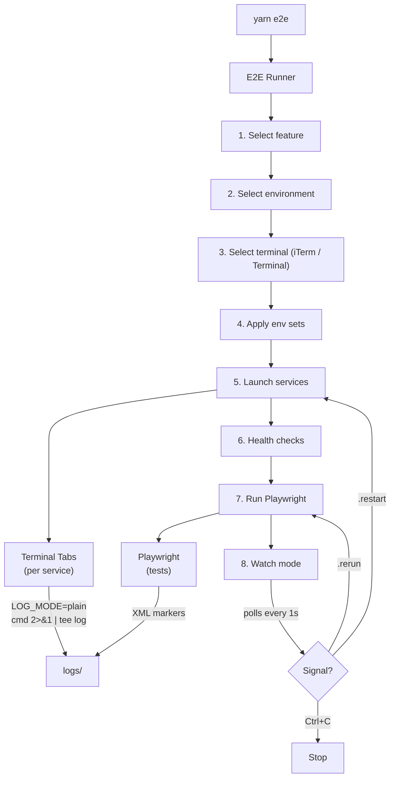

# Canary Lab

A unified E2E test orchestration platform. Discover, configure, and run Playwright E2E tests across multiple independent services with cross-service log correlation and a self-healing loop.

## Quick Start

```bash
git clone <your-fork-url> canary-lab
cd canary-lab
yarn install
npx playwright install chromium
yarn e2e
```

Select `example_todo_api`, choose your terminal (iTerm or Terminal), and the example runs end-to-end.

## Features

- **Single entry point** — `yarn e2e` discovers all features, launches services, runs tests
- **Auto-discovery** — any folder in `features/` with a `feature.config.ts` is automatically detected
- **Cross-service logs** — XML test markers enable per-test-case log extraction across all services
- **Watch mode** — signal `touch logs/.rerun` or `touch logs/.restart` to iterate on fixes
- **Self-healing loop** — Claude Code reads test results, diagnoses failures from logs, fixes code, and re-runs
- **Environment sets** — named env configs that backup/restore across multiple repos
- **Scaffold CLI** — `yarn new-feature` generates all boilerplate in seconds

## How It Works



## Add Your Own Feature

```bash
yarn new-feature my_feature "Description of what this tests"
```

This generates all required files. Then:
1. Edit `features/my_feature/feature.config.ts` — add your repos, start commands, and health checks
2. Edit `features/my_feature/src/config.ts` — add feature-specific env var exports
3. Write tests in `features/my_feature/e2e/`
4. Run `yarn e2e`

## Structure

```
canary-lab/
├── features/                    # Individual feature folders
│   └── feature-name/
│       ├── feature.config.ts    # Feature metadata, repos, env config
│       ├── e2e/                 # Playwright tests
│       ├── envsets/             # Environment variable sets
│       ├── playwright.config.ts
│       └── tsconfig.json
├── scripts/
│   └── new-feature.ts           # Feature scaffolding (yarn new-feature)
├── shared/
│   ├── configs/                 # Shared base configs
│   │   ├── tsconfig.feature.json
│   │   ├── playwright.base.ts
│   │   └── loadEnv.ts
│   ├── e2e-runner/              # E2E orchestrator
│   │   ├── runner.ts            # Main entry (yarn e2e)
│   │   ├── log-marker-fixture.ts
│   │   └── summary-reporter.ts
│   ├── launcher/                # Terminal tab management
│   │   ├── iterm.ts             # iTerm2 launcher (AppleScript)
│   │   ├── terminal.ts          # Terminal.app launcher (AppleScript)
│   │   ├── startup.ts           # Health checks, path resolution
│   │   └── types.ts
│   └── env-switcher/            # Environment switching helpers
└── logs/                        # (gitignored) Runtime logs & signals
```

## Terminal Support

The service launcher supports **iTerm2** and **Terminal.app** on macOS via AppleScript. You choose which terminal to use when running `yarn e2e`.

The `tee` command used for log capture is a standard POSIX utility that works in any terminal on any Unix-like system. Only the tab-opening mechanism is macOS-specific.

## Self-Healing Loop

With Claude Code (or any AI assistant), the self-healing loop works as follows:
1. Claude reads `logs/e2e-summary.json` for pass/fail results
2. For failures, extracts per-test logs using XML markers: `sed -n '/<test-slug>/,/<\/test-slug>/p' logs/svc-*.log`
3. Diagnoses the root cause from cross-service logs
4. Fixes the source code (never test files)
5. Signals `touch logs/.rerun` or `touch logs/.restart`
6. Repeats up to 3 times per failing test case

## Contributing

1. Fork the repo
2. Create a feature branch
3. Add your feature using `yarn new-feature`
4. Submit a PR

## License

[MIT](LICENSE)
