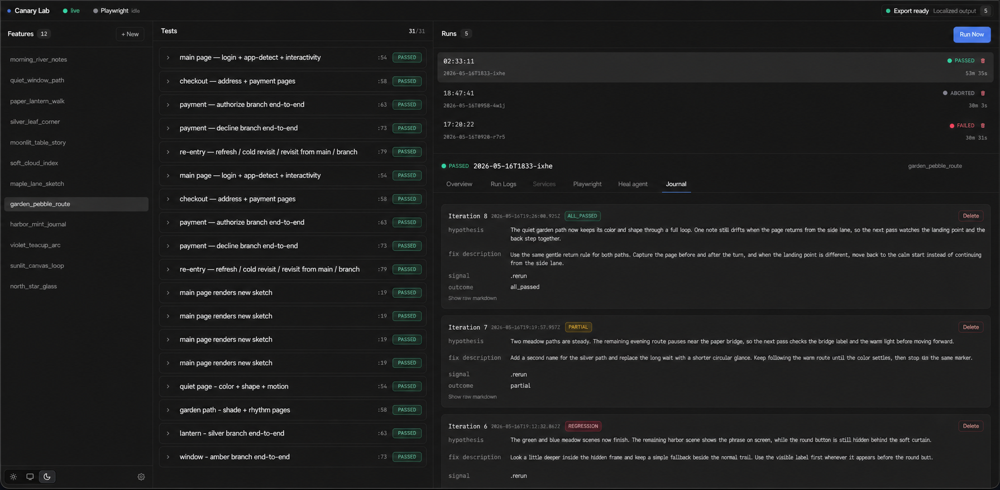
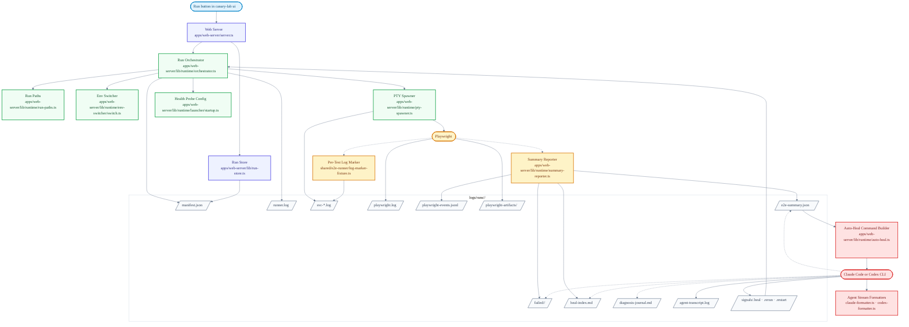

# Canary Lab

[](https://www.npmjs.com/package/canary-lab)
[](LICENSE)

Playwright tells you what failed. Canary Lab preserves the local system context needed to fix it.

Canary Lab is a local control plane for Playwright-based E2E work. It starts the services a feature depends on, applies the selected envset, gates the run on health checks, runs Playwright, and writes run-scoped evidence: service logs, Playwright events, screenshots/videos/traces, summaries, and diagnosis notes. When a run fails, a human or agent can work from exact file paths instead of pasted terminal output.

[](docs/assets/canary-lab-ui-walkthrough.webm)

See [CHANGELOG.md](CHANGELOG.md) for what's new in each release.

## Mental Model

Playwright is still the test runner. Canary Lab is the workspace around the run.

A typical failure is rarely just a failed assertion. It may depend on which env file was active, whether the local services were healthy, what the backend logged while the test was running, and which screenshot, trace, or video Playwright produced. Canary Lab keeps those pieces together for each run so the next step is based on the actual local state, not a pasted error message.

Canary Lab owns the surrounding workflow:

- start the services a feature needs, wait for them to be ready, and stop them cleanly
- apply the selected envset across the local repos involved in the run
- keep service logs, Playwright output, screenshots, videos, traces, and event history under one run
- separate logs by test so a failure points at the relevant window of activity
- give a human or agent a shared place to review evidence, write diagnosis notes, and request a rerun or restart

Canary Lab does not replace Playwright or hide its output. It keeps Playwright visible, then adds the local system context needed to debug the result.

## Who This Is For

Use this if:

- your tests depend on more than one local app or service
- you often switch env files during local testing
- you want failure context collected in one place
- you want Claude Code or Codex to work from logs and summaries instead of only a pasted test failure

## Who This Is Not For

This is probably not for you if:

- you only test a single app
- normal Playwright fixtures, reporters, and scripts are enough
- you need Linux or Windows support today
- you want a CI-first tool rather than a local development workflow

## Current Scope

- **Cross-platform.** Services and the heal agent run inside `node-pty` pseudo-terminals owned by Canary Lab — no AppleScript, no iTerm, no Terminal.app. The web UI streams those PTYs into your browser.
- **Node.js ≥ 20**, **npm ≥ 9**.
- A modern browser (Chrome / Firefox / Safari) for the local UI on `http://localhost:7421`.
- **Optional, for headless auto-heal:** [Claude Code CLI](https://docs.claude.com/en/docs/claude-code) (`claude`) or [Codex CLI](https://github.com/openai/codex) (`codex`) on `PATH`.

## Quick Start

```bash
npx canary-lab init my-lab
cd my-lab
npm install
npm run install:browsers
npx canary-lab ui
```

`canary-lab ui` boots a local Fastify server on `http://localhost:7421` and opens it in your default browser. The UI is a 3-column Finder-style layout:

1. **Features** — every `features/<name>/` discovered in the project, with a "Run" button per feature.
2. **Runs** — the last 20 runs preserved under `logs/runs/<runId>/`, each with status, timing, and per-test results.
3. **Run detail** — overview, service PTYs, Playwright terminal/playback, heal-agent output, and the selected run's diagnosis journal.

Pass `--no-open` to suppress the browser auto-launch (useful over SSH or in CI). Pass `--port <n>` to bind a different port.

## What Gets Scaffolded

- `features/example_todo_api` — working Playwright E2E sample
- `features/broken_todo_api` — CRUD API with intentional handler bugs; a warm-up for the self-heal workflow
- `features/tricky_checkout_api` — checkout API with subtle pricing/calculation bugs
- `features/flaky_orders_api` — orders API with env-driven config and subtle coupon/tax bugs
- `CLAUDE.md` and `AGENTS.md` — managed `self heal` guidance using `logs/current/...`

## Commands

```bash
npx canary-lab init <folder>
npx canary-lab ui # primary surface (web UI)
npx canary-lab upgrade
```

`canary-lab upgrade` is for syncing scaffolded docs and skills in an existing project with the current package version. It is not a general dependency or repo upgrade system.

## Environment Switching

The web UI manages temporary environment files for a feature. In the Envsets tab, create an env, add the files that should be swapped during a run, edit their values, and start the run from the UI.

Canary Lab stores those envsets under `features/<feature>/envsets/`. The UI keeps `envsets.config.json` in sync with the files it manages, including which local file each slot replaces. During a run, Canary Lab backs up current target files, applies the selected envset, and restores the originals afterward.

If you need to inspect the config directly, `envsets/envsets.config.json` uses three main fields: `appRoots` for named local repo paths, `slots` for files Canary Lab can temporarily replace, and `feature.slots` for the slots applied by that feature.

### Environment variable safety

Envset files often contain credentials, API keys, and database passwords copied from local app configs. The default `.gitignore` ignores `features/*/envsets/*/*` to prevent accidental commits.

If you override this or use `git add -f`, review what you are committing. Do not push env files containing real credentials to shared or public repositories.

## What Gets Written Per Run

Each run gets its own directory under `logs/runs/<runId>/`. The exact contents depend on the feature, whether Playwright ran, and whether a heal cycle was started, but the main paths are:

- `manifest.json` — run metadata, selected feature, service status, repo snapshots, artifact policy, and signal paths
- `runner.log` — orchestration events such as service startup, health checks, Playwright start/exit, detected signals, and cleanup
- `svc-*.log` — stdout/stderr captured from each started service
- `playwright.log` — raw Playwright stdout/stderr from the run
- `playwright-events.jsonl` — structured test and browser-action events used by Playback
- `playwright-artifacts/` — Playwright output directory for retained screenshots, videos, traces, and attachments
- `e2e-summary.json` — current test state, failed tests, and failure context written by the summary reporter
- `failed/<slug>/` — per-failure slices and, when available, Playwright MCP captures for that failure
- `heal-index.md` — compact failure index for human or agent-driven repair, written when failures are enriched
- `diagnosis-journal.md` — heal-cycle hypotheses, changed files, signals, and outcomes when healing has run
- `agent-transcript.log` — raw Claude or Codex output when auto-heal runs
- `signals/` — `.heal`, `.rerun`, and `.restart` files used to pause, rerun tests, or restart affected services

Outside the run directory, `logs/runs/index.json` tracks run history and `logs/current/` points at the active run so manual agents can use stable paths while the UI keeps the full run history.

## Self-Fixing Workflow

Two flavors, same idea:

- **Manual (`self heal`)** — you stay in the driver's seat. Start a run from the web UI, leave it open, open Claude or Codex in the project folder, and type `self heal`. The agent follows the managed `heal-prompt` section in `CLAUDE.md` (or `AGENTS.md` for Codex), which points at `logs/current/...`.
- **Auto-heal** — the runner itself spawns a Claude or Codex agent when a test fails. The agent runs in its own PTY tab inside the web UI. Canary Lab renders its packaged `apps/web-server/prompts/heal-agent.md` template with the active run's exact file paths and passes that prompt to the agent. Output is filtered through a formatter so you see readable progress instead of raw stream-json.

In both cases the agent starts from the active run's `heal-index.md` (a compact index over each failure, pointing at pre-sliced service logs under `failed/<slug>/`), falls back to that run's `e2e-summary.json` if the index is missing, fixes implementation code, and signals the runner via `logs/current/signals/.restart` or `logs/current/signals/.rerun`.

### Why this works for agents

The agent is not asked to reconstruct the run from terminal scrollback. Canary Lab gives it:

- `logs/current/heal-index.md` as the first stop when failures have been enriched
- failure-specific files under `logs/current/failed/<slug>/` instead of whole-service scrollback
- `logs/current/e2e-summary.json` and `logs/current/playwright-events.jsonl` for the current Playwright state
- `logs/current/diagnosis-journal.md` when prior heal cycles exist
- `logs/current/signals/.rerun` and `logs/current/signals/.restart` so the runner owns the next Playwright pass and service restart

### Manual heal

Set the project heal agent to **Manual** when you want to drive the fix yourself. In manual mode, a failing run stays in the healing state and waits for a signal file.

1. Open a new terminal in the project folder you created with `npx canary-lab init`.
2. Run `claude` (or `codex`) there.
3. Send the single prompt: `self heal`.

The interactive agent reads the managed `heal-prompt` section in `CLAUDE.md` (or `AGENTS.md`). After a fix, it writes one of the active run's signal files:

- `logs/current/signals/.restart` for service or app changes
- `logs/current/signals/.rerun` for test/config-only changes

Auto-heal uses the same signal contract, but it is capped by the runner. The current default is 3 heal cycles. If auto-heal gives up, exits without a signal, or no Claude/Codex CLI is available, the run finishes as failed; start another run or switch the project to Manual before retrying the hand-driven loop.

## Limitations

- The self-fixing workflow depends on services writing useful log output. If a service produces little or no logs, the agent has less context to work with.
- Envset runs overwrite target files in place while the run is active. If the backup/restore cycle is interrupted (e.g., kill -9), originals may not be restored automatically. Re-open the UI and use the envset controls to recover from backups.
- Envset files are local dev config. They are not validated or checked for correctness — if you copy a stale config, tests may fail for non-obvious reasons.

## How It Works

### Runtime flow


## For Contributors

### Code Orientation

- `server.ts` wires the local Fastify app, UI assets, routes, and WebSocket streams.
- `orchestrator.ts` is the conductor for a run: service startup, health checks, Playwright invocation, run manifest updates, envset cleanup, and heal-loop signaling.
- `run-store.ts` indexes per-run manifests, summaries, Playwright events, and retained artifacts for the UI.
- `env-switcher/switch.ts` still performs the low-level env-file apply/revert work; the UI is the public way to drive it.
- `feature-support/` is the public import surface generated projects use (`canary-lab/feature-support/...`). Everything under `apps/`, `scripts/`, and `shared/` is internal.

### Run Architecture

This diagram shows the code path for a run started from `canary-lab ui`. It is intentionally implementation-facing; the UI still presents this as one run detail view.



### Local Development

```bash
npm install
npm run build
```

### Repository Layout

- `scripts/` — CLI entry and scaffold/upgrade commands
- `apps/web-server/` — local server, API routes, runtime orchestrator, run store, and PTY streams
- `apps/web/` — React UI for features, runs, playback, journals, and configuration
- `shared/e2e-runner/` — Playwright fixture support used by generated projects
- `shared/configs/` — base Playwright config and env loader
- `shared/runtime/` — shared `project-root` resolver
- `templates/project/` — files copied into scaffolded projects
- `feature-support/` — public imports used by generated projects

### Build and Test

```bash
npm run build
npm test              # unit tests (Vitest)
npm run smoke:pack    # end-to-end scaffold test
```

`npm test` runs the Vitest unit suite. Use `npm run test:watch` during development and `npm run test:coverage` for a coverage report.

`smoke:pack` builds, packs, scaffolds a temp project, installs dependencies, and verifies the scaffold flow. Run it after changing templates or packaging.

### Publishing

```bash
npm run smoke:pack    # end-to-end scaffold test
npm run publish:package
```

## License

[MIT](LICENSE)
