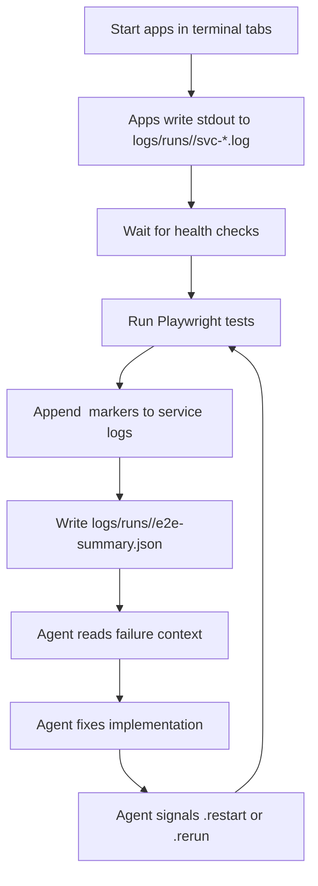
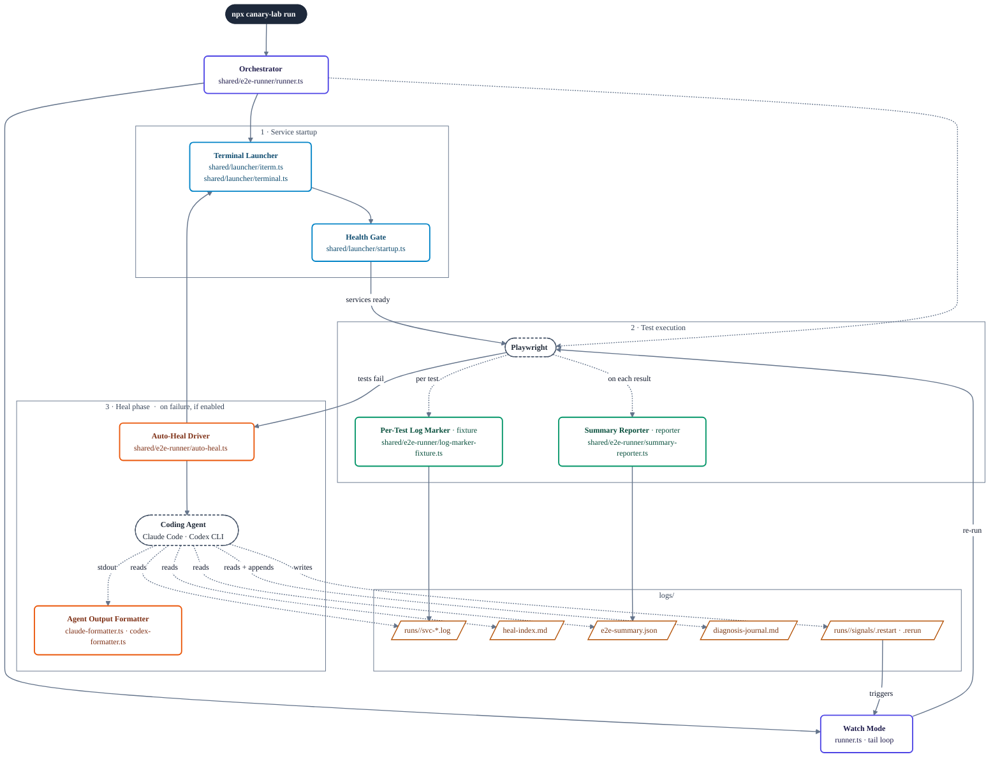

# Canary Lab

[](https://www.npmjs.com/package/canary-lab)
[](LICENSE)

Canary Lab is a local E2E workflow layer built on top of Playwright.

It is built for cases where one test depends on multiple local apps or services, not just one app in isolation. Canary Lab starts those services, gates tests on health checks, runs Playwright with per-test service-log slicing, and — on failure — hands the agent (Claude Code or Codex) a structured map of what broke so it can diagnose, fix, and signal a re-run.

As of 0.10.0, the primary surface is a local web UI (`canary-lab ui`) — a 3-column Finder-style view of features, runs, and live logs, with a built-in journal viewer and an Add Test wizard. The legacy iTerm/Terminal-tab CLI flow (`canary-lab run`) is still around but deprecated and will be removed in 0.11.0.

See [CHANGELOG.md](CHANGELOG.md) for what's new in each release.

## What This Tool Is

This is not a replacement for Playwright.

Playwright already handles browser automation and test execution well. Canary Lab adds a local workflow layer around that, especially for multi-service setups.

Playwright gives you:

- browser automation
- assertions, fixtures, and reporters
- test execution and retries

Canary Lab adds:

- multi-service orchestration: parallel startup, health gating, log capture (each service runs in its own pseudo-terminal, streamed to the web UI)
- per-test log slicing so failures map directly to the service output that produced them
- a local web UI for selecting features, watching runs live, and browsing per-run history
- an agent-driven self-heal loop (structured failure index → diagnosis → `.restart`/`.rerun` → re-run), driven from the web UI
- a persistent cross-run diagnosis journal so the agent doesn't repeat hypotheses between cycles
- an Add Test wizard (PRD → skill recommender → plan → spec generation) for guided test authoring
- temporary env-file switching across repos

## Who This Is For

Use this if:

- your tests depend on more than one local app or service
- you often switch env files during local testing
- you want failure context collected in one place
- you want Claude Code or Codex to work from logs and summaries instead of only a pasted test failure

## Who This Is Not For

This is probably not for you if:

- you only test a single app
- normal Playwright fixtures, reporters, and scripts are enough
- you need Linux or Windows support today
- you want a CI-first tool rather than a local development workflow

## Current Scope

- **Cross-platform.** Services and the heal agent run inside `node-pty` pseudo-terminals owned by Canary Lab — no AppleScript, no iTerm, no Terminal.app. The web UI streams those PTYs into your browser.
- **Node.js ≥ 20**, **npm ≥ 9**.
- A modern browser (Chrome / Firefox / Safari) for the local UI on `http://localhost:7421`.
- **Optional, for headless auto-heal:** [Claude Code CLI](https://docs.claude.com/en/docs/claude-code) (`claude`) or [Codex CLI](https://github.com/openai/codex) (`codex`) on `PATH`.

## Quick Start

```bash
npx canary-lab init my-lab
cd my-lab
npm install
npm run install:browsers
npx canary-lab ui
```

`canary-lab ui` boots a local Fastify server on `http://localhost:7421` and opens it in your default browser. The UI is a 3-column Finder-style layout:

1. **Features** — every `features/<name>/` discovered in the project, with a "Run" button per feature.
2. **Runs** — the last 20 runs preserved under `logs/runs/<runId>/`, each with status, timing, and per-test results.
3. **Logs** — live PTY output from services + Playwright + the heal agent, plus a journal viewer for `logs/diagnosis-journal.md` (cross-run, tagged by `run:`).

Pass `--no-open` to suppress the browser auto-launch (useful over SSH or in CI). Pass `--port <n>` to bind a different port.

## What Gets Scaffolded

- `features/example_todo_api` — working Playwright E2E sample
- `features/broken_todo_api` — CRUD API with intentional handler bugs; a warm-up for the self-heal workflow
- `features/tricky_checkout_api` — checkout API with subtle pricing/calculation bugs
- `features/flaky_orders_api` — orders API with env-driven config and subtle coupon/tax bugs
- `CLAUDE.md` for Claude (manual `self heal` guide using `logs/current/...`, plus `.claude/skills/env-import.md` for importing env files from repos)
- `AGENTS.md` for Codex (matching manual guide; env-import skill at `.codex/env-import.md`)

## Commands

```bash
npx canary-lab init <folder>
npx canary-lab ui                                 # primary surface (web UI)
npx canary-lab run                                # legacy CLI; deprecated, removed in 0.11.0
npx canary-lab env
npx canary-lab new-feature <name> "Description"
npx canary-lab upgrade
```

`canary-lab upgrade` is for syncing scaffolded docs and skills in an existing project with the current package version. It is not a general dependency or repo upgrade system.

## Benchmarking

If you want to compare Canary Lab's structured heal loop against a more naive baseline, `canary-lab run` can record benchmark artifacts under `logs/benchmark/`.

```bash
npx canary-lab run --benchmark --benchmark-mode=canary
npx canary-lab run --benchmark --benchmark-mode=baseline
```

Benchmark mode does not create a separate runner. Both modes use the same Canary Lab orchestrator, the same self-heal loop, and the same per-run `signals/.rerun` / `signals/.restart` signaling. The thing being compared is the agent context, not the runner itself.

Benchmark mode writes:

- `logs/benchmark/run.json`
- `logs/benchmark/cycles.jsonl`
- `logs/benchmark/context/cycle-<n>.json`
- `logs/benchmark/final-summary.json`

`canary` mode benchmarks the normal structured context: the active run's `e2e-summary.json`, enriched per-test log slices, and `logs/diagnosis-journal.md` when present.

`baseline` mode keeps that exact same runtime flow, but the agent gets only Playwright-style failure context and explores the codebase on its own.

Important clarification for `baseline`:

- services still start through the normal orchestrator
- service logs may still be produced on disk
- the agent simply is not given Canary Lab's structured debugging context such as diagnosis journal or per-test sliced logs

## Environment Switching

`npx canary-lab env` manages temporary environment files for a feature. It backs up current env files, applies a named set, and restores the originals when you revert.

An env set is a named group of environment files stored under `features/<feature>/envsets/`.

### `envsets.config.json`

Each feature defines its env setup in `envsets/envsets.config.json`:

```json
{
  "appRoots": {
    "CANARY_LAB": "/Users/me/Documents/canary-lab",
    "APP_A": "/Users/me/Documents/app-a"
  },
  "slots": {
    "feature.env": {
      "description": "Feature .env file",
      "target": "$CANARY_LAB/features/sample_feature/.env"
    },
    "app-a.env.local": {
      "description": "App A local env file",
      "target": "$APP_A/.env.local"
    }
  },
  "feature": {
    "slots": ["feature.env", "app-a.env.local"],
    "testCommand": "npm run test:e2e",
    "testCwd": "$CANARY_LAB/features/sample_feature"
  }
}
```

- `appRoots` — base paths to local repos
- `slots` — files that can be swapped temporarily
- `feature.slots` — which slots this feature uses

### Importing env files from repos

Claude and Codex can help import env files from repos declared in `feature.config.cjs`. See `.claude/skills/env-import.md` or `.codex/env-import.md` in generated projects.

### Environment variable safety

Envset files often contain credentials, API keys, and database passwords copied from local app configs. The default `.gitignore` ignores `features/*/envsets/*/*` to prevent accidental commits.

If you override this or use `git add -f`, review what you are committing. Do not push env files containing real credentials to shared or public repositories.

## Self-Fixing Workflow

Two flavors, same idea:

- **Manual (`self heal`)** — you stay in the driver's seat. Start a run from the web UI, leave it open, open Claude or Codex in the project folder, and type `self heal`. The agent follows the managed `heal-prompt` section in `CLAUDE.md` (or `AGENTS.md` for Codex), which points at `logs/current/...`.
- **Auto-heal** — the runner itself spawns a Claude or Codex agent when a test fails. The agent runs in its own PTY tab inside the web UI. Canary Lab renders its packaged `apps/web-server/prompts/heal-agent.md` template with the active run's exact file paths and passes that prompt to the agent. Output is filtered through a formatter so you see readable progress instead of raw stream-json.

In both cases the agent starts from the active run's `heal-index.md` (a compact index over each failure, pointing at pre-sliced service logs under `failed/<slug>/`), falls back to that run's `e2e-summary.json` if the index is missing, fixes implementation code, and signals the runner via that run's `signals/.restart` or `signals/.rerun`.

### When auto-heal isn't available

If the headless agent gave up or isn't installed, you can still drive the loop by hand:

1. Open a new terminal in the project folder you created with `npx canary-lab init`.
2. Run `claude` (or `codex`) there.
3. Send the single prompt: `self heal`.

The interactive agent reads the managed `heal-prompt` section in `CLAUDE.md` (or `AGENTS.md`) and drives the active run's `.rerun`/`.restart` signals, so the runner will pick up its work without any extra setup.

If the agent struck out after 3 cycles, the runner gives up on auto-heal — write `logs/current/signals/.rerun` to retry, or run the agent interactively as above.

## Limitations

- The self-fixing workflow depends on services writing useful log output. If a service produces little or no logs, the agent has less context to work with.
- `canary-lab env` overwrites target files in place. If the backup/restore cycle is interrupted (e.g., kill -9), originals may not be restored. Use `canary-lab env --revert` to recover from backups.
- Envset files are local dev config. They are not validated or checked for correctness — if you copy a stale config, tests may fail for non-obvious reasons.

## How It Works

### Runtime flow



### Components involved in a test run

This view focuses on what happens when you type `npx canary-lab run`. Each box is a component named by its role, with its file location underneath. Solid arrows are calls or writes; dotted arrows show when a component is triggered.



**Legend.** Color is carried by the border: indigo = core runner, blue = service startup, green = Playwright hooks, orange = heal phase, dashed slate = external processes, amber = files in `logs/`. Solid arrows are direct calls; dotted arrows fire during a lifecycle event (per test, on failure, etc.); thick arrows are the main happy-path transitions.

**When each component fires:**

- **Orchestrator** (`runner.ts`) runs first, for the whole duration. It loads `feature.config.cjs`, delegates to everything below, and stays alive in watch mode.
- **Terminal Launcher** + **Health Gate** run once per `run`, before tests start — one terminal tab per service, blocked on health checks.
- **Playwright** is invoked once per run by the orchestrator. While it runs:
  - **Per-Test Log Marker** fires **before and after every test**, writing `<test-tag>` boundaries into per-run `svc-*.log` files so you can slice logs by test.
  - **Summary Reporter** fires **on every test result** (and at end-of-suite), incrementally updating `logs/runs/<runId>/e2e-summary.json`.
- **Auto-Heal Driver** fires **only when tests fail and auto-heal is enabled**. It spawns a Claude Code or Codex CLI agent in a new terminal tab, piping its stdout through the **Agent Output Formatter**.
- The **Coding Agent** starts at the run-scoped `heal-index.md` (with that run's `e2e-summary.json` as a fallback) to pick which failure to tackle, drills into the pre-sliced service logs under `logs/runs/<runId>/failed/<slug>/`, edits code, then writes `.restart` or `.rerun` under `logs/runs/<runId>/signals/`. The runner appends `logs/diagnosis-journal.md` entries from those signal bodies.
- **Watch Mode** (the tail end of `runner.ts`) picks up those signal files and re-invokes Playwright.

**At a glance:**

- `runner.ts` is the conductor: it reads each feature's `feature.config.cjs`, starts services through the runtime launcher, runs Playwright with `summary-reporter` + `log-marker-fixture` attached, then sits in watch mode reacting to the active run's `.restart` / `.rerun` signal files.
- `auto-heal.ts` spawns a Claude Code or Codex CLI process when auto-heal is on. Its raw output is filtered through `claude-formatter.ts` (Claude) or `codex-formatter.ts` (Codex) into readable progress.
- `launcher/iterm.ts` and `launcher/terminal.ts` are interchangeable backends — both drive their app via AppleScript. `launcher/startup.ts` holds the shared health-check + command-normalization helpers.
- `env-switcher/switch.ts` does the actual env-file swap; `root-cli.ts` is the interactive prompt wrapper.
- `runtime/project-root.ts` is the single source of truth for "where does this project live" — everyone else asks it.
- `feature-support/` is the only surface generated projects import from (`canary-lab/feature-support/...`). Everything under `shared/` is internal.

## For Contributors

### Local Development

```bash
npm install
npm run build
```

### Repository Layout

- `scripts/` — CLI entry and scaffold commands (`init`, `new-feature`, `upgrade`)
- `shared/e2e-runner/` — runner, auto-heal, formatters, Playwright reporter + fixture
- `shared/launcher/` — iTerm / Terminal.app backends and startup helpers
- `shared/env-switcher/` — env-file apply/revert logic and interactive CLI
- `shared/runtime/` — shared `project-root` resolver
- `shared/configs/` — base Playwright config and env loader
- `templates/project/` — files copied into scaffolded projects
- `feature-support/` — public imports used by generated projects

### Build and Test

```bash
npm run build
npm test              # unit tests (Vitest)
npm run smoke:pack    # end-to-end scaffold test
```

`npm test` runs the Vitest unit suite. Use `npm run test:watch` during development and `npm run test:coverage` for a coverage report.

`smoke:pack` builds, packs, scaffolds a temp project, installs dependencies, and verifies the scaffold flow. Run it after changing templates or packaging.

### Publishing

```bash
npm run smoke:pack    # end-to-end scaffold test
npm run publish:package
```

## License

[MIT](LICENSE)
