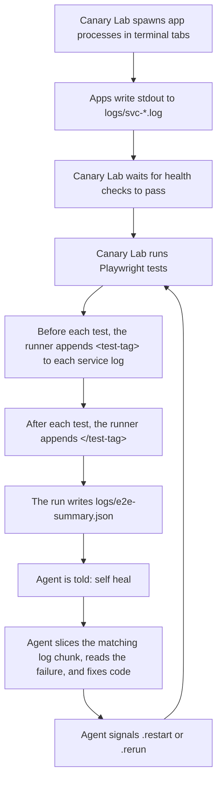

# Canary Lab

Canary Lab is an npm package for end-to-end testing with Playwright, local service orchestration, and agent-assisted debugging. It scaffolds a runnable E2E project, starts dependent services, captures service logs, and provides a structured self-fixing workflow for Claude or Codex.

If you are looking for a small E2E testing starter for local development, a Playwright-based test harness, or a self-fixing demo for AI coding agents, this package aims to be a useful starting point.

## What It Tries To Help With

- Scaffold an E2E test project quickly
- Run Playwright tests against local services from one command
- Capture per-service logs and a machine-readable failure summary
- Give Claude or Codex a documented workflow for diagnosing and fixing failures
- Keep generated projects visible while shipping package internals as compiled code

## For Users

Use Canary Lab when you want to bootstrap a local E2E testing project and experiment with an agent-assisted self-fixing loop.

### Quick Start

```bash
npx canary-lab init my-lab
cd my-lab
npm install
npm run install:browsers
npx canary-lab run
```

### What Gets Scaffolded

The generated project includes:

- `features/example_todo_api` as a working Playwright E2E sample
- `features/broken_todo_api` as an intentionally broken sample for self-fixing
- `CLAUDE.md` and `.claude/skills/self-fixing-loop.md` for Claude
- `AGENTS.md` and `.codex/self-fixing-loop.md` for Codex

### Main Commands

```bash
npx canary-lab init <folder>
npx canary-lab run
npx canary-lab env
npx canary-lab new-feature <name> "Description"
```

### Environment Switching

`npx canary-lab env` helps manage temporary environment files for a feature.

This is useful when you want to:

- apply a known env setup before running E2E tests
- switch between different local test configurations
- avoid manually editing `.env` files each time
- restore the previous env files after the run

When you run `npx canary-lab env`, Canary Lab:

- finds features that define env sets
- lets you choose whether to apply or revert
- backs up the current target env files
- applies the selected env set
- restores the previous files when you revert

An env set is a named group of environment files for a feature, usually stored under `features/<feature>/envsets/`.

Typical usage:

```bash
npx canary-lab env
```

Then choose the feature and env set you want, such as `local`.

### Self-Fixing Workflow

1. Run `npx canary-lab run`
2. Choose the broken sample
3. Leave the runner open in watch mode
4. Open Claude or Codex in the generated project
5. Type:

```text
self heal
```

`self heal` is a documented agent phrase, not a CLI command. It tells the agent to follow its canonical self-fixing workflow, inspect `logs/e2e-summary.json` and `logs/svc-*.log`, fix implementation only, and trigger `touch logs/.restart` or `touch logs/.rerun` as needed.

### What Makes It Different

Compared with a minimal E2E starter, Canary Lab also includes:

- a runner that launches services and waits on health checks
- structured failure context for agents
- generated project guidance for both Claude and Codex
- a built-in broken sample to exercise the workflow end to end

### Observability Matters

Canary Lab works best when the application under test emits useful logs.

The self-fixing workflow depends on being able to correlate a failing test with the service output that happened during that test window. If a service produces little or no log output, the agent has much less context to work with, and the loop becomes correspondingly less useful.

In practice, this means basic observability still matters:

- services should write meaningful stdout or stderr logs
- error paths should emit enough context to explain what failed
- health checks and startup logs should make service state visible

Canary Lab can organize and narrow the logs for a given test case, but it cannot recover context that the application never emitted.

## For Contributors

Use this repo when you are improving the package itself: the CLI, scaffold templates, runtime, smoke tests, or publish flow.

### Local Development

```bash
npm install
npm run build
```

### How It Works



The basic flow is:

- Canary Lab starts the required apps in terminal tabs
- those apps write stdout to `logs/svc-*.log`
- once health checks pass, Canary Lab runs Playwright
- before a test runs, the runner appends a `<test-tag>` marker to each service log
- after the test finishes, the runner appends the matching `</test-tag>`
- the run writes `logs/e2e-summary.json`

After that, an agent can be told:

```text
self heal
```

At that point the agent can:

- `logs/e2e-summary.json`
- `logs/svc-*.log`
- the canonical self-fixing workflow doc

and use the tags to read the matching chunk of each service log for the failed test, fix the implementation, and signal `touch logs/.restart` or `touch logs/.rerun`.

### Repository Areas

- `scripts/` contains the package CLI and scaffold commands
- `shared/` contains the runtime behind `run` and `env`
- `templates/project/` contains the generated project files
- `feature-support/` contains the public imports used by generated projects

### Contributor Workflow

Typical loop:

```bash
npm run build
npm run smoke:pack
```

If you change scaffold docs, generated files, or packaging behavior, validate by scaffolding a fresh temp project from the built package.

### Packaging and Release Checks

```bash
npm run pack:check
npm run smoke:pack
npm run publish:package
```

- `pack:check` inspects the npm tarball contents
- `smoke:pack` builds, packs, scaffolds a temp project, installs dependencies, and verifies the scaffold flow
- `publish:package` runs build and tarball checks before `npm publish`

### Local Tarball Test

Before publishing, prefer testing the packed tarball instead of `npm link`:

```bash
npm run build
npm pack
mkdir /tmp/canary-lab-smoke
cd /tmp/canary-lab-smoke
npm init -y
npm install /absolute/path/to/canary-lab-0.1.0.tgz
npx canary-lab init test-folder
```

This tests the exact tarball npm would publish.

## License

[MIT](LICENSE)
