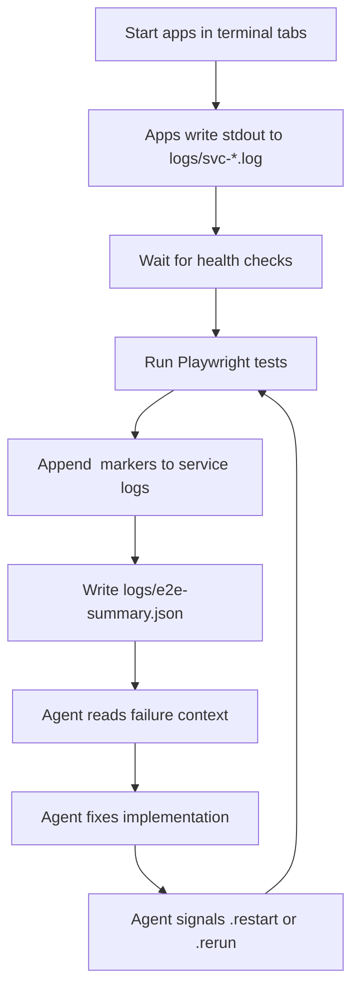

# Canary Lab

E2E testing with Playwright, local service orchestration, and agent-assisted debugging.

## Capabilities

| Capability | What it does |
|-----------|-------------|
| Project scaffolding | `canary-lab init` creates a runnable E2E project from templates |
| Feature generator | `canary-lab new-feature` scaffolds a new test feature with config, envsets, and spec files |
| Service orchestration | Starts declared apps in terminal tabs, waits on health checks, captures stdout to `logs/svc-*.log` |
| Environment switching | `canary-lab env` applies/reverts named sets of env files across multiple repos |
| Env import | Claude/Codex-guided workflow to find and copy env files from declared repos into a feature's envsets |
| Self-fixing workflow | Claude/Codex-guided loop: read failure context, form hypothesis, fix implementation, signal runner, evaluate |
| Log correlation | XML markers (`<test-tag>...</test-tag>`) in service logs allow per-test log slicing |
| Managed upgrades | `canary-lab upgrade` keeps skills and docs in sync; runs automatically via postinstall hook |

## Quick Start

```bash
npx canary-lab init my-lab
cd my-lab
npm install
npm run install:browsers
npx canary-lab run
```

## What Gets Scaffolded

- `features/example_todo_api` — working Playwright E2E sample
- `features/broken_todo_api` — intentionally broken sample for self-fixing practice
- `CLAUDE.md` and `.claude/skills/` for Claude
- `AGENTS.md` and `.codex/` for Codex

## Commands

```bash
npx canary-lab init <folder>
npx canary-lab run
npx canary-lab env
npx canary-lab new-feature <name> "Description"
npx canary-lab upgrade
```

## Environment Switching

`npx canary-lab env` manages temporary environment files for a feature. It backs up current env files, applies a named set, and restores the originals when you revert.

An env set is a named group of environment files stored under `features/<feature>/envsets/`.

### `envsets.config.json`

Each feature defines its env setup in `envsets/envsets.config.json`:

```json
{
  "appRoots": {
    "CANARY_LAB": "/Users/me/Documents/canary-lab",
    "APP_A": "/Users/me/Documents/app-a"
  },
  "slots": {
    "feature.env": {
      "description": "Feature .env file",
      "target": "$CANARY_LAB/features/sample_feature/.env"
    },
    "app-a.env.local": {
      "description": "App A local env file",
      "target": "$APP_A/.env.local"
    }
  },
  "feature": {
    "slots": ["feature.env", "app-a.env.local"],
    "testCommand": "npm run test:e2e",
    "testCwd": "$CANARY_LAB/features/sample_feature"
  }
}
```

- `appRoots` — base paths to local repos
- `slots` — files that can be swapped temporarily
- `feature.slots` — which slots this feature uses

### Importing env files from repos

Claude and Codex can help import env files from repos declared in `feature.config.cjs`. See `.claude/skills/env-import.md` or `.codex/env-import.md` in generated projects.

### Environment variable safety

Envset files often contain credentials, API keys, and database passwords copied from local app configs. The default `.gitignore` ignores `features/*/envsets/*/*` to prevent accidental commits.

If you override this or use `git add -f`, review what you are committing. Do not push env files containing real credentials to shared or public repositories.

## Self-Fixing Workflow

1. Run `npx canary-lab run` and choose the broken sample
2. Leave the runner open in watch mode
3. Open Claude or Codex in the generated project
4. Type `self heal`

The agent follows `.claude/skills/self-fixing-loop.md` (or `.codex/self-fixing-loop.md`): reads `logs/e2e-summary.json`, slices service logs by test markers, fixes implementation code, and signals the runner via `logs/.restart` or `logs/.rerun`.

## Limitations

- The self-fixing workflow depends on services writing useful log output. If a service produces little or no logs, the agent has less context to work with.
- `canary-lab env` overwrites target files in place. If the backup/restore cycle is interrupted (e.g., kill -9), originals may not be restored. Use `canary-lab env --revert` to recover from backups.
- Envset files are local dev config. They are not validated or checked for correctness — if you copy a stale config, tests may fail for non-obvious reasons.

## How It Works



## For Contributors

### Local Development

```bash
npm install
npm run build
```

### Repository Layout

- `scripts/` — CLI and scaffold commands
- `shared/` — runtime for `run` and `env`
- `templates/project/` — generated project files
- `feature-support/` — public imports used by generated projects

### Build and Test

```bash
npm run build
npm run smoke:pack
```

`smoke:pack` builds, packs, scaffolds a temp project, installs dependencies, and verifies the scaffold flow. Run it after changing templates or packaging.

### Publishing

```bash
npm run pack:check    # inspect tarball contents
npm run smoke:pack    # end-to-end scaffold test
npm run publish:package
```

## License

[MIT](LICENSE)
