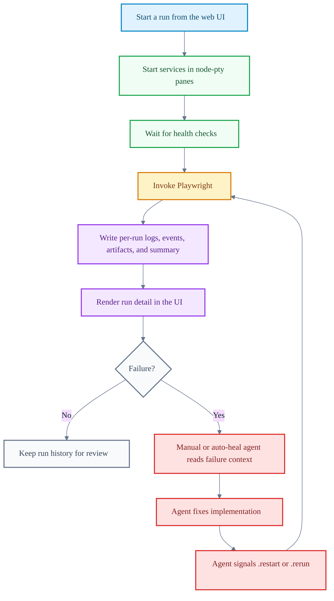
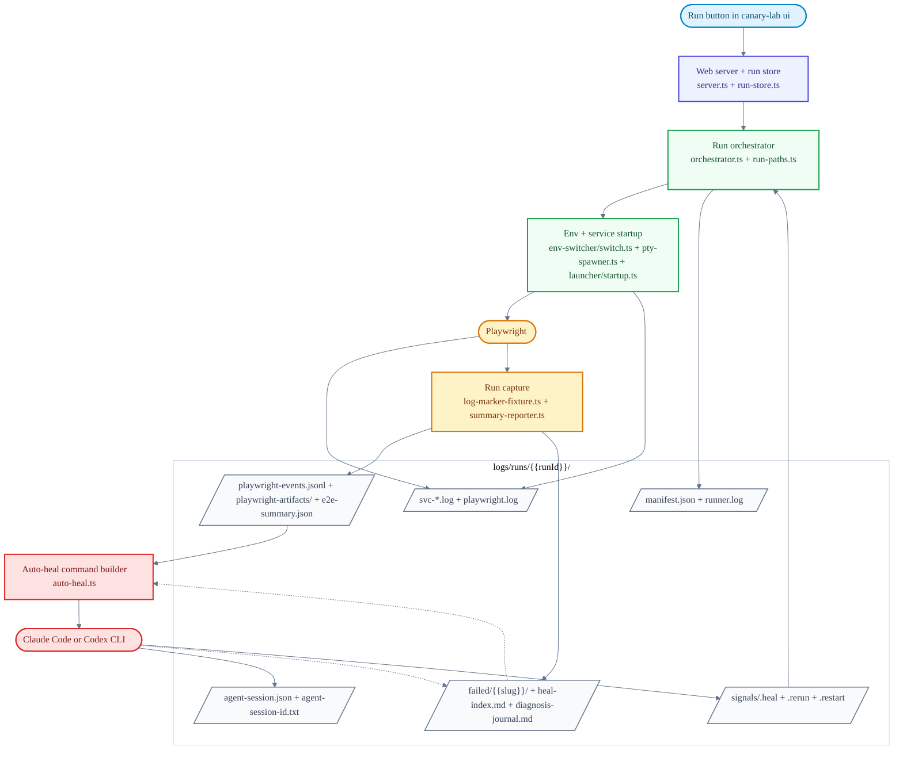

# Canary Lab

[](https://www.npmjs.com/package/canary-lab)
[](LICENSE)

Canary Lab is a local orchestration layer for evaluating agent-built features with Playwright.

The workflow is simple: an agent implements a feature in your app, then writes Playwright tests that describe the behavior the feature should prove. Canary Lab starts the required services, applies the selected envset, invokes Playwright, and stores the full evidence for each run: service logs, Playwright output, screenshots, traces, videos, failure summaries, and diagnosis notes.

When a test fails, the agent does not need to work from a pasted error or terminal scrollback. It reads the run context Canary Lab saved, fixes the app or the test, signals a rerun or restart, and lets Canary Lab continue the cycle until the behavior is verified with evidence.

Playwright remains the test runner. Canary Lab is the control plane around it: feature scaffolding, envset switching, service orchestration, run history, failure context, agent handoff, and repeatable reruns.


See [CHANGELOG.md](CHANGELOG.md) for what's new in each release.

## What Canary Lab Owns

Canary Lab has a narrow boundary. It does not define a new test language, assertion model, or browser runner. Agents and engineers write Playwright tests, and Playwright executes them.

Canary Lab handles the run context around Playwright:

- feature folder structure and scaffold conventions
- envset application and cleanup
- service startup, health checks, PTY streams, and shutdown
- run manifests, lifecycle events, logs, and retained artifacts
- failure slices, summaries, journals, and agent handoff prompts
- rerun and restart signals after a fix

The goal is to keep the run state explicit. A failed Playwright run should have enough surrounding context for the next human or agent to inspect what happened, change the app or test, and continue from the same run without relying on terminal scrollback.

## Who This Is For

Use this if:

- you use agents to implement features and want an evidence-backed evaluation loop
- you want agents to write Playwright tests, inspect failures, fix code, and rerun without losing context
- your Playwright tests depend on local services, env files, or multiple repos
- you want service logs, Playwright output, artifacts, summaries, and diagnosis notes kept with each run
- you want Claude, Codex, or another agent to work from saved run context instead of terminal scrollback

## Who This Is Not For

This is probably not for you if:

- a plain `npx playwright test` command gives you enough context
- you do not need service orchestration, env switching, or retained run history
- you do not want agents involved in writing, debugging, or rerunning tests
- you want a CI-first tool rather than a local development workflow
- you need a polished Linux or Windows workflow today

## Current Scope

- **Local PTY orchestration.** Services and the heal agent run inside `node-pty` — no AppleScript, no iTerm, no Terminal.app. The web UI streams those PTYs into your browser.
- **Node.js ≥ 20**, **npm ≥ 9**.
- A modern browser (Chrome / Firefox / Safari) for the local UI on `http://localhost:7421`.
- **Optional, for agent-driven repair:** [Claude Code CLI](https://docs.claude.com/en/docs/claude-code) (`claude`) or [Codex CLI](https://github.com/openai/codex) (`codex`) on `PATH`.

## Quick Start

```bash
npx canary-lab init my-lab
cd my-lab
npm install
npm run install:browsers
npx canary-lab ui
```

`canary-lab ui` boots a local Fastify server on `http://localhost:7421` and opens it in your default browser. The UI is a 3-column Finder-style layout:

1. **Features** — every `features/<name>/` discovered in the project, with a "Run" button per feature.
2. **Runs** — the last 20 runs preserved under `logs/runs/<runId>/`, each with status, timing, and per-test results.
3. **Run detail** — overview, service PTYs, Playwright terminal/playback, heal-agent output, and the selected run's diagnosis journal.

Pass `--no-open` to suppress the browser auto-launch (useful over SSH or in CI). Pass `--port <n>` to bind a different port:

```bash
npx canary-lab ui --port 8123
```

`canary-lab init` scaffolds four sample features (`example_todo_api`, `broken_todo_api`, `tricky_checkout_api`, `flaky_orders_api`) so you can try the heal workflow before bringing your own services.

## Feature Authoring

A feature is a folder under `features/<name>/` with a `feature.config.cjs`, a Playwright config, envsets, and Playwright specs. Agents should write normal Playwright tests in `e2e/`; Canary Lab gives those tests a stable feature folder, shared package helpers, and a runner that knows how to start the surrounding system.

You can create the folder from the UI or with:

```bash
npx canary-lab new feature checkout-discounts --description "Validate checkout discounts"
```

The web UI also includes an Add Test workflow. Paste a PRD or upload a document, choose the repos that matter, review the generated plan, review the generated Playwright files, and then accept the feature into the project. The generated files still run through Playwright; Canary Lab only provides the scaffold, review flow, and orchestration around the run.

## Commands

```bash
npx canary-lab init <folder>
npx canary-lab ui # primary surface (web UI)
npx canary-lab ui --port 8123 # use a custom UI port
npx canary-lab mcp # bridge a local MCP client to the UI server
npx canary-lab mcp doctor # verify the local MCP bridge
npx canary-lab agent install <codex|claude|all>
npx canary-lab new feature <name> --description "..."
npx canary-lab new-feature <name> --description "..."
npx canary-lab env apply <feature> <set>
npx canary-lab env revert <feature>
npx canary-lab upgrade
```

The `new feature`, `new-feature`, and `env` commands are deterministic wrappers for agents and scripts. The web UI remains the primary human workflow for creating features, editing envsets, running tests, and reviewing results.

The `mcp` command bridges local AI clients into the running Canary Lab UI server. MCP clients can list features, start or resume runs, fetch heal context, write diagnosis notes, signal reruns or restarts, and wait for the next repair task without scraping terminal output.

`canary-lab upgrade` is for syncing scaffolded docs and skills in an existing project with the current package version. It is not a general dependency or repo upgrade system.

## Environment Switching

The web UI manages temporary environment files for a feature. In the Envsets tab, create an env, add the files that should be swapped during a run, edit their values, and start the run from the UI. Canary Lab stores envsets under `features/<feature>/envsets/`, backs up the target files at the start of each run, and restores them afterward.

Feature configs can also declare env-specific service startup. For example, a `local` env can boot a service from `startCommands`, while a `production` env can skip local startup and point Playwright at a deployed URL through the selected envset.

If setting envsets up by hand feels tedious, the scaffolded project ships env-import guidance for both Claude and Codex (`.claude/skills/env-import.md` and `.codex/env-import.md`). Ask the agent to import env files for a feature; it will inspect the repos declared in `feature.config.cjs`, copy selected env files into `features/<feature>/envsets/`, and update `envsets.config.json`.

### Environment variable safety

Envset files often contain credentials, API keys, and database passwords copied from local app configs. The default `.gitignore` ignores `features/*/envsets/*/*` to prevent accidental commits. If you override this or use `git add -f`, review what you are committing — don't push real credentials to shared or public repositories.

## What Gets Written Per Run

Each run gets its own directory under `logs/runs/<runId>/`. The exact contents depend on the feature, whether Playwright ran, and whether a heal cycle was started, but the main paths are:

- `manifest.json` — run metadata, selected feature, service status, repo snapshots, artifact policy, and signal paths
- `runner.log` — orchestration events such as service startup, health checks, Playwright start/exit, detected signals, and cleanup
- `lifecycle-events.jsonl` — structured lifecycle events used by the UI to render run progress and recovery state
- `svc-*.log` — stdout/stderr captured from each started service
- `playwright.log` — raw Playwright stdout/stderr from the run
- `playwright-events.jsonl` — structured test and browser-action events used by Playback
- `playwright-artifacts/` — Playwright output directory for retained screenshots, videos, traces, and attachments
- `playwright-artifacts-keep/` — durable artifact snapshots kept across targeted reruns
- `e2e-summary.json` — current test state, failed tests, and failure context written by the summary reporter
- `failed/<slug>/` — per-failure slices and, when available, Playwright MCP captures for that failure
- `heal-index.md` — compact failure index for human or agent-driven repair, written when failures are enriched
- `diagnosis-journal.md` — heal-cycle hypotheses, changed files, signals, and outcomes when healing has run
- `agent-session.json` and `agent-session-id.txt` — pointers to the Claude or Codex session used for structured replay when auto-heal runs
- `signals/` — `.heal`, `.rerun`, and `.restart` files used to pause, rerun tests, or restart affected services

Outside the run directory, `logs/runs/index.json` tracks run history and `logs/current/` points at the active run so manual agents can use stable paths while the UI keeps the full run history.

## Evaluation Report

Each completed run can export a single-page **Evaluation Report** for the feature it ran — the "Export Evaluation" button in the run detail Overview tab. The download is a `.zip` containing one final `evaluation.html` report and any captured videos. Use the raw export for a fast report, or the localized export when you want the configured Heal Agent to rewrite test titles and flowchart labels into accessible English. Localized wording is cached with the run so repeated exports stay stable.


The report starts with stakeholder-readable evaluation language: what behavior was checked, why it matters, the run result, and the strength of the evidence in plain terms. The engineering evidence remains in the same artifact: each test case can expand its flowchart, test code, helper code, videos, and exact checks.

The intended use is PR or product review. A green run says the suite passed; the evaluation report says what it actually proved in language useful to both product stakeholders and engineers.

## Self-Fixing Workflow

When a Playwright test fails, an agent fixes the app or the test. The scaffolded project ships with `CLAUDE.md` and `AGENTS.md` containing the managed `heal-prompt` section; both flavors point at `logs/current/...`. After a fix, the agent writes one of the active run's signal files: `signals/.restart` for service or app changes, `signals/.rerun` for test/config-only changes.

### Auto-heal

The runner spawns a Claude or Codex agent in its own PTY tab inside the web UI when a test fails. Canary Lab renders its packaged `apps/web-server/prompts/heal-agent.md` template with the active run's exact file paths and passes that prompt to the agent. Output is filtered through a formatter so you see readable progress instead of raw stream-json.

Auto-heal keeps cycling until the tests pass, the user stops the run, the agent exits without a useful signal, a cycle times out, or no Claude/Codex CLI is available. If the run finishes as failed, start another run or switch the project to Manual before retrying the hand-driven loop.

### Manual heal

Set the project heal agent to **Manual** when you want to drive the fix yourself. A failing run stays in the healing state and waits for a signal file.

1. Open a new terminal in the project folder you created with `npx canary-lab init`.
2. Run `claude` (or `codex`) there.
3. Send the single prompt: `self heal`.

The interactive agent reads the managed `heal-prompt` section in `CLAUDE.md` (or `AGENTS.md`) and writes the same `.restart` / `.rerun` signal files described above.

### Why this works for agents

The agent is not asked to reconstruct the run from terminal scrollback. In both flavors, it starts from the active run's `heal-index.md` (a compact index over each failure, pointing at pre-sliced service logs under `failed/<slug>/`) and falls back to `e2e-summary.json` if the index is missing. Canary Lab gives it:

- `logs/current/heal-index.md` as the first stop when failures have been enriched
- failure-specific files under `logs/current/failed/<slug>/` instead of whole-service scrollback
- `logs/current/e2e-summary.json` and `logs/current/playwright-events.jsonl` for the current Playwright state
- `logs/current/diagnosis-journal.md` when prior heal cycles exist
- `logs/current/signals/.rerun` and `logs/current/signals/.restart` so the runner owns the next Playwright pass and service restart

## Limitations

- The self-fixing workflow depends on services writing useful log output. If a service produces little or no logs, the agent has less context to work with.
- Envset runs overwrite target files in place while the run is active. If the backup/restore cycle is interrupted (e.g., kill -9), originals may not be restored automatically. Re-open the UI and use the envset controls to recover from backups.
- Envset files are local dev config. They are not validated or checked for correctness — if you copy a stale config, tests may fail for non-obvious reasons.

## How It Works

### Runtime flow



## For Contributors

### Code Orientation

- `server.ts` wires the local Fastify app, UI assets, routes, and WebSocket streams.
- `orchestrator.ts` is the conductor for a run: service startup, health checks, Playwright invocation, run manifest updates, envset cleanup, and heal-loop signaling.
- `run-store.ts` indexes per-run manifests, summaries, Playwright events, and retained artifacts for the UI.
- `env-switcher/switch.ts` still performs the low-level env-file apply/revert work; the UI is the public way to drive it.
- `feature-support/` is the public import surface generated projects use (`canary-lab/feature-support/...`). Everything under `apps/`, `scripts/`, and `shared/` is internal.

### Run Architecture

This diagram shows the code path for a run started from `canary-lab ui`. It is intentionally implementation-facing; the UI still presents this as one run detail view.



### Local Development

```bash
npm install
npm run build
```

### Repository Layout

- `scripts/` — CLI entry, scaffold/upgrade commands, MCP bridge, and agent integration installer
- `apps/web-server/` — local server, API routes, runtime orchestrator, run store, and PTY streams
- `apps/web/` — React UI for features, runs, playback, journals, and configuration
- `shared/e2e-runner/` — Playwright fixture support used by generated projects
- `shared/configs/` — base Playwright config and env loader
- `shared/runtime/` — shared `project-root` resolver
- `templates/project/` — files copied into scaffolded projects

The package exposes a `canary-lab/feature-support/...` import surface to generated projects via the `exports` field in `package.json`; it maps to compiled files under `dist/shared/configs/`, `dist/shared/e2e-runner/`, and `dist/shared/launcher/`.

### Build and Test

```bash
npm run build
npm test              # unit tests (Vitest)
npm run smoke:pack    # end-to-end scaffold test
```

`npm test` runs the Vitest unit suite. Use `npm run test:watch` during development and `npm run test:coverage` for a coverage report.

`smoke:pack` builds, packs, scaffolds a temp project, installs dependencies, and verifies the scaffold flow. Run it after changing templates or packaging.

### Contributing

Open a pull request against `main`.

## License

[MIT](LICENSE)
