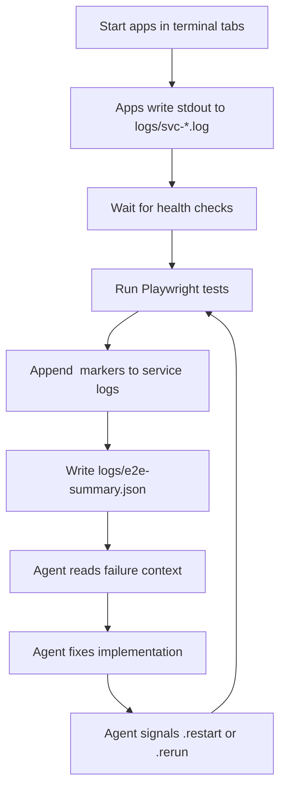
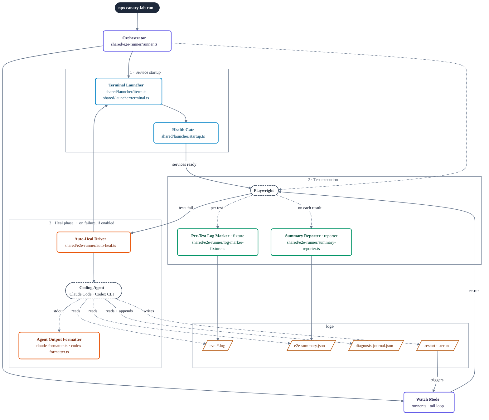

# Canary Lab

[](https://www.npmjs.com/package/canary-lab)
[](LICENSE)

E2E testing with Playwright, local service orchestration, and agent-assisted debugging.

See [CHANGELOG.md](CHANGELOG.md) for what's new in each release.

## Requirements

- **macOS only.** The runner drives iTerm / Terminal.app via AppleScript (`osascript`) to open service and heal-agent tabs. Linux and Windows are not supported yet — there's no fallback launcher.
- **Node.js ≥ 20**, **npm ≥ 9**.
- **iTerm2** (recommended) or the built-in **Terminal.app**.
- **Optional, for headless auto-heal:** [Claude Code CLI](https://docs.claude.com/en/docs/claude-code) (`claude`) or [Codex CLI](https://github.com/openai/codex) (`codex`) on `PATH`. The interactive fallback (see [When auto-heal isn't available](#when-auto-heal-isnt-available)) works with either CLI or the Desktop apps.

## Capabilities

| Capability | What it does |
|-----------|-------------|
| Project scaffolding | `canary-lab init` creates a runnable E2E project from templates |
| Feature generator | `canary-lab new-feature` scaffolds a new test feature with config, envsets, and spec files |
| Service orchestration | Starts declared apps in terminal tabs, waits on health checks, captures stdout to `logs/svc-*.log` |
| Environment switching | `canary-lab env` applies/reverts named sets of env files across multiple repos |
| Env import | Claude/Codex-guided workflow to find and copy env files from declared repos into a feature's envsets |
| Self-fixing workflow | Claude/Codex-guided loop: read failure context, form hypothesis, fix implementation, signal runner, evaluate |
| Log correlation | XML markers (`<test-tag>...</test-tag>`) in service logs allow per-test log slicing |
| Managed upgrades | `canary-lab upgrade` keeps skills and docs in sync; runs automatically via postinstall hook |

## Quick Start

```bash
npx canary-lab init my-lab
cd my-lab
npm install
npm run install:browsers
npx canary-lab run
```

## What Gets Scaffolded

- `features/example_todo_api` — working Playwright E2E sample
- `features/broken_todo_api` — intentionally broken sample for self-fixing practice
- `features/tricky_checkout_api` — a more realistic checkout API sample with a local test server
- `CLAUDE.md` and `.claude/skills/` for Claude (`env-import`, `heal-loop`, `self-fixing-loop`)
- `AGENTS.md` and `.codex/` for Codex (matching guides)

## Commands

```bash
npx canary-lab init <folder>
npx canary-lab run
npx canary-lab env
npx canary-lab new-feature <name> "Description"
npx canary-lab upgrade
```

## Environment Switching

`npx canary-lab env` manages temporary environment files for a feature. It backs up current env files, applies a named set, and restores the originals when you revert.

An env set is a named group of environment files stored under `features/<feature>/envsets/`.

### `envsets.config.json`

Each feature defines its env setup in `envsets/envsets.config.json`:

```json
{
  "appRoots": {
    "CANARY_LAB": "/Users/me/Documents/canary-lab",
    "APP_A": "/Users/me/Documents/app-a"
  },
  "slots": {
    "feature.env": {
      "description": "Feature .env file",
      "target": "$CANARY_LAB/features/sample_feature/.env"
    },
    "app-a.env.local": {
      "description": "App A local env file",
      "target": "$APP_A/.env.local"
    }
  },
  "feature": {
    "slots": ["feature.env", "app-a.env.local"],
    "testCommand": "npm run test:e2e",
    "testCwd": "$CANARY_LAB/features/sample_feature"
  }
}
```

- `appRoots` — base paths to local repos
- `slots` — files that can be swapped temporarily
- `feature.slots` — which slots this feature uses

### Importing env files from repos

Claude and Codex can help import env files from repos declared in `feature.config.cjs`. See `.claude/skills/env-import.md` or `.codex/env-import.md` in generated projects.

### Environment variable safety

Envset files often contain credentials, API keys, and database passwords copied from local app configs. The default `.gitignore` ignores `features/*/envsets/*/*` to prevent accidental commits.

If you override this or use `git add -f`, review what you are committing. Do not push env files containing real credentials to shared or public repositories.

## Self-Fixing Workflow

Two flavors, same idea:

- **Manual (`self heal`)** — you stay in the driver's seat. Run `npx canary-lab run`, leave it in watch mode, open Claude or Codex in the project, and type `self heal`. The agent follows `.claude/skills/self-fixing-loop.md` (or `.codex/self-fixing-loop.md`).
- **Auto-heal (`heal-loop`)** — the runner itself spawns a Claude or Codex agent when a test fails, following `.claude/skills/heal-loop.md`. Output is filtered through a formatter so you see readable progress instead of raw stream-json.

In both cases the agent reads `logs/e2e-summary.json`, slices service logs by `<test-tag>` markers, fixes implementation code, and signals the runner via `logs/.restart` or `logs/.rerun`.

### When auto-heal isn't available

If you didn't pick an auto-heal agent, or the headless agent gave up / isn't installed, you can still drive the loop by hand:

1. Open a new terminal in the project folder you created with `npx canary-lab init`.
2. Run `claude` (or `codex`) there.
3. Send the single prompt: `self heal`.

The interactive agent reads the same `.claude/skills/self-fixing-loop.md` (or `.codex/self-fixing-loop.md`) and drives the same `.rerun`/`.restart` signals, so the runner will pick up its work without any extra setup.

If you picked an agent up front and it struck out after 3 cycles, the runner prints the manual options (`touch logs/.rerun`, `touch logs/.heal` to reset strikes and re-spawn, or run the agent interactively as above).

## Limitations

- The self-fixing workflow depends on services writing useful log output. If a service produces little or no logs, the agent has less context to work with.
- `canary-lab env` overwrites target files in place. If the backup/restore cycle is interrupted (e.g., kill -9), originals may not be restored. Use `canary-lab env --revert` to recover from backups.
- Envset files are local dev config. They are not validated or checked for correctness — if you copy a stale config, tests may fail for non-obvious reasons.

## How It Works

### Runtime flow



### Components involved in a test run

This view focuses on what happens when you type `npx canary-lab run`. Each box is a component named by its role, with its file location underneath. Solid arrows are calls or writes; dotted arrows show when a component is triggered.



**Legend.** Color is carried by the border: indigo = core runner, blue = service startup, green = Playwright hooks, orange = heal phase, dashed slate = external processes, amber = files in `logs/`. Solid arrows are direct calls; dotted arrows fire during a lifecycle event (per test, on failure, etc.); thick arrows are the main happy-path transitions.

**When each component fires:**

- **Orchestrator** (`runner.ts`) runs first, for the whole duration. It loads `feature.config.cjs`, delegates to everything below, and stays alive in watch mode.
- **Terminal Launcher** + **Health Gate** run once per `run`, before tests start — one terminal tab per service, blocked on health checks.
- **Playwright** is invoked once per run by the orchestrator. While it runs:
  - **Per-Test Log Marker** fires **before and after every test**, writing `<test-tag>` boundaries into `svc-*.log` so you can slice logs by test.
  - **Summary Reporter** fires **on every test result** (and at end-of-suite), incrementally updating `logs/e2e-summary.json`.
- **Auto-Heal Driver** fires **only when tests fail and auto-heal is enabled**. It spawns a Claude Code or Codex CLI agent in a new terminal tab, piping its stdout through the **Agent Output Formatter**.
- The **Coding Agent** reads `e2e-summary.json` and the marked-up `svc-*.log`, edits code, then touches `.restart` or `.rerun`. It also reads and appends to `diagnosis-journal.json` — a running log of hypotheses, fixes, and outcomes across cycles so it doesn't retry an approach that already failed.
- **Watch Mode** (the tail end of `runner.ts`) picks up those signal files and re-invokes Playwright.

**At a glance:**

- `runner.ts` is the conductor: it reads each feature's `feature.config.cjs`, starts services through the macOS launcher, runs Playwright with `summary-reporter` + `log-marker-fixture` attached, then sits in watch mode reacting to `logs/.restart` / `logs/.rerun`.
- `auto-heal.ts` spawns a Claude Code or Codex CLI process when auto-heal is on. Its raw output is filtered through `claude-formatter.ts` (Claude) or `codex-formatter.ts` (Codex) into readable progress.
- `launcher/iterm.ts` and `launcher/terminal.ts` are interchangeable backends — both drive their app via AppleScript. `launcher/startup.ts` holds the shared health-check + command-normalization helpers.
- `env-switcher/switch.ts` does the actual env-file swap; `root-cli.ts` is the interactive prompt wrapper.
- `runtime/project-root.ts` is the single source of truth for "where does this project live" — everyone else asks it.
- `feature-support/` is the only surface generated projects import from (`canary-lab/feature-support/...`). Everything under `shared/` is internal.

## For Contributors

### Local Development

```bash
npm install
npm run build
```

### Repository Layout

- `scripts/` — CLI entry and scaffold commands (`init`, `new-feature`, `upgrade`)
- `shared/e2e-runner/` — runner, auto-heal, formatters, Playwright reporter + fixture
- `shared/launcher/` — iTerm / Terminal.app backends and startup helpers
- `shared/env-switcher/` — env-file apply/revert logic and interactive CLI
- `shared/runtime/` — shared `project-root` resolver
- `shared/configs/` — base Playwright config and env loader
- `templates/project/` — files copied into scaffolded projects
- `feature-support/` — public imports used by generated projects

### Build and Test

```bash
npm run build
npm test              # unit tests (Vitest)
npm run smoke:pack    # end-to-end scaffold test
```

`npm test` runs the Vitest unit suite. Use `npm run test:watch` during development and `npm run test:coverage` for a coverage report.

`smoke:pack` builds, packs, scaffolds a temp project, installs dependencies, and verifies the scaffold flow. Run it after changing templates or packaging.

### Publishing

```bash
npm run smoke:pack    # end-to-end scaffold test
npm run publish:package
```

## License

[MIT](LICENSE)
