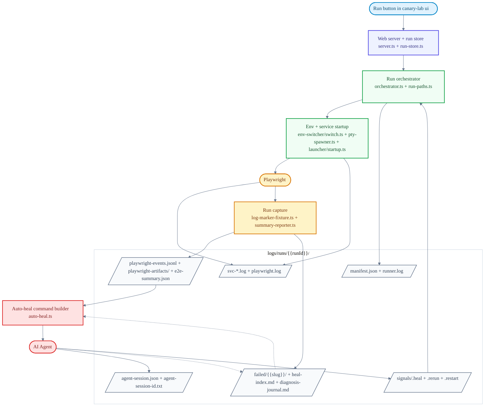

# Canary Lab Architecture

Contributor-facing reference for how the system fits together. This is the canonical
home for mechanisms and invariants: `CLAUDE.md` carries only commands and hard rules,
the `.claude/skills/` workflows carry procedures, and both point here for the "why".
For product intent, see [PRD.md](PRD.md). For user-facing usage, see the
[README](../README.md) and [GUIDE.md](GUIDE.md).

**Contents**

- [Package Model](#package-model)
- [Module Map](#module-map)
- [Run Lifecycle](#run-lifecycle)
- [Concurrency](#concurrency)
- [Heal System](#heal-system)
- [MCP Layer](#mcp-layer)
- [Portify and Benchmark](#portify-and-benchmark)
- [Keep-in-Sync Invariants](#keep-in-sync-invariants)

## Package Model

- One published CLI: `canary-lab`. Main subcommands: `init`, `setup`, `ui`, `mcp`,
  `new feature`, `env`, `upgrade`.
- Package internals ship as compiled code in `dist/` (built by `npm run build`:
  `tools/clean-dist.mjs` → `tsc -p tsconfig.build.json` → `tools/prepare-assets.mjs`
  → Vite build for the web UI).
- Scaffold templates live in `templates/project/` and are **copied into
  `dist/templates/` during build** by `tools/prepare-assets.mjs`. Editing a template
  without rebuilding does nothing for consumers — `npm run smoke:pack` is the
  packaging-level check.
- The only public import surface for generated projects is
  `canary-lab/feature-support/...` (via `package.json` exports). Everything under
  `apps/`, `scripts/`, and `shared/` is internal.

## Module Map

| Path | What lives there |
| --- | --- |
| `scripts/` | CLI entry, scaffold/setup/upgrade/env commands, MCP bridge (`scripts/mcp.ts` includes `inferMcpClientKind` client-kind detection) |
| `apps/web-server/server.ts` | Fastify app: UI assets, REST routes, WebSocket streams, the `startRun` factory, scheduler wiring |
| `apps/web-server/mcp/` | MCP HTTP server (`server.ts`: transports, profile instructions) and tools (`tools.ts`: thin wrappers + profile arrays) |
| `apps/web-server/lib/` | Run store, external heal broker, heal-claim policy, feature authoring, external heal surface |
| `apps/web-server/lib/runtime/` | The run orchestrator and its ~57 modules (see [Run Lifecycle](#run-lifecycle) and below) |
| `apps/web/` | React UI (Vite, Tailwind) |
| `shared/e2e-runner/` | Playwright fixture support (`log-marker-fixture`, summary reporter) |
| `shared/configs/` | Base Playwright config and env loader |
| `shared/runtime/` | Shared project-root resolver |
| `templates/project/` | Scaffolded workspace files, incl. five sample features: `example_todo_api` (happy path), `broken_todo_api` (heal target), `flaky_orders_api`, `tricky_checkout_api`, `acme_cart_checkout` |
| `tools/` | Build/publish utilities: `clean-dist`, `prepare-assets`, `smoke-pack`, `publish-package`, `generate-changelog`, `tag-release`, `fix-node-pty-permissions` |

Key `apps/web-server/lib/runtime/` modules:

| Module | Role |
| --- | --- |
| `orchestrator.ts` | Single-run lifecycle: env apply, service boot, Playwright run, heal cycles, manifest/journal writes |
| `launcher/startup.ts`, `pty-spawner.ts` | Service startup, health probes (HTTP/TCP), PTY capture |
| `launcher/interpolate.ts` | Token resolution — the reserved `${port.<slot>}` namespace |
| `port-allocator.ts` | Per-run free-TCP-port allocation per declared port slot |
| `admission.ts`, `run-scheduler.ts` | Resource-aware admission + FIFO queue promotion |
| `repo-collision.ts`, `repo-worktree.ts` | Same-repo collision detection + per-run git worktree isolation |
| `auto-heal.ts` | Local heal-agent binary resolution and spawn command building |
| `heal-cycle.ts`, `heal-prompt-builder.ts` | Heal-cycle state machine and prompt assembly |
| `manifest.ts`, `run-paths.ts`, `run-id.ts` | Run manifest schema and path/id conventions |
| `summary-reporter.ts`, `log-enrichment.ts`, `trace-enrichment.ts` | Evidence capture and enrichment |
| `portify/` | Agent-driven port-injection workflow (see [Portify](#portify-and-benchmark)) |
| `benchmark/` | Multi-arm self-heal benchmarking (retired from the product in 1.0.0; code retained) |

## Run Lifecycle

Code path for a run started from `canary-lab ui`:

In prose: the `startRun` factory in `apps/web-server/server.ts` admits/queues the run
(see [Concurrency](#concurrency)), then `orchestrator.ts` applies the selected envset,
boots services through the launcher/PTY layer (each service's PTY output is captured
programmatically into `svc-<name>.log` — never echoed to the server's stdout), runs
Playwright, and captures evidence. On failure, the run either spawns a local heal agent
(`auto-heal.ts`) or parks for an external client (see [Heal System](#heal-system)).
The agent fixes code and drops a `rerun`/`restart` signal; the orchestrator continues
the same run until pass or terminal failure.

### Logging and retention

Logs live under `<workspace>/logs/`. Per-run artifacts are in `logs/runs/<runId>/`:
`runner.log` (orchestrator narration), `svc-<name>.log`, `playwright.log`,
`external-commands.jsonl` (per-command audit for external heal), failure slices, and
the manifest. There is no automatic retention/pruning — runs persist on disk until
removed manually via the Log Cleanup page (`GET /api/cleanup/runs`, backed by
`RunStore.delete` / `trimArtifacts`), which deletes whole runs or trims Playwright
artifacts while keeping the manifest and `runner.log`.

## Concurrency

Multiple runs can be active at once (since 1.2.0). The top-right **Runs** dialog in
`canary-lab ui` lists every run (running/healing/queued/finished).

### Per-run ports

A `startCommand` declares `ports: [{ name: 'api', env: 'PORT' }]` (env optional). The
orchestrator allocates a free TCP port per slot per run
(`apps/web-server/lib/runtime/port-allocator.ts`), injects it as the service's `env`
var (`PORT`), exposes it to config via the reserved token `${port.api}`, and to the
Playwright process as `CANARY_PORT_<slot>`.

`${port.<slot>}` resolves in **three places** (the `port` token namespace lives in
`apps/web-server/lib/runtime/launcher/interpolate.ts`):

1. the **command** (`--port ${port.api}`),
2. the **`healthCheck`** URL,
3. at apply-time, inside **applied envset files** (`.env`/`.properties`/`.env.local`)
   via `applySet`'s resolver (`resolvePortTokens`).

So inter-service URLs and config-file listen ports (e.g. Spring
`server.port=${port.mpass}`, `oddle.oms.url=http://localhost:${port.oms}`) follow the
run's allocation. Test helpers resolve the target as
`CANARY_PORT_api → GATEWAY_URL → hardcoded default` (see any sample
`e2e/helpers/api.ts`). The CLI `env` switching path passes no resolver, so it stays a
verbatim copy.

### Same-repo collision

The heal loop edits repo code in place, so two runs on the *same* repo would corrupt
each other. Starting a second run on an active repo returns
`repo_collision_requires_choice` (REST 409 / MCP result). The user chooses
**worktree** (isolate the run in a per-run `git worktree` under `<runDir>/worktrees/`
and run now) or **queue** (wait until the conflicting run finishes). Different-repo
runs never collide. See `apps/web-server/lib/runtime/repo-collision.ts` +
`repo-worktree.ts`.

### Admission and queue

Runs beyond a CPU/free-RAM heuristic are parked as `queued` (status `queued`, with
`manifest.queueReason`) and promoted FIFO on run-end. Optional hard ceiling via env
`CANARY_MAX_CONCURRENT_RUNS`. The scheduler is
`apps/web-server/lib/runtime/run-scheduler.ts` (decision logic in `admission.ts`);
it's wired into the `startRun` factory in `server.ts` and promotes on the RunStore
`finalized` event.

### Multi-service limits (what concurrency can't auto-fix)

Worktree isolation covers concurrent heal *edits*, not *ports* — two runs of the same
multi-service app still can't both boot, so they queue. Apps that hardcode a port in
source (ignoring `PORT`/`--port`/config) can't be relocated — that's what
[Portify](#portify-and-benchmark) fixes. OAuth issuer + redirect URIs are
pre-registered with the provider for a fixed host:port, so OAuth features (e.g.
`mpass_oauth`) run one at a time regardless of any rewiring. The `${port}` envset
resolver unlocks *different* multi-service features running concurrently (each gets
distinct ports) and cleaner single multi-service runs — not same-app concurrent
isolation.

## Heal System

### Local auto-heal

With `healAgent: 'claude'|'codex'|'auto'`, the orchestrator spawns a local agent CLI.
The agent's **absolute path** is resolved by `resolveAgentBinary`
(`apps/web-server/lib/runtime/auto-heal.ts`): explicit override
(`CANARY_LAB_CLAUDE_BIN` / `CANARY_LAB_CODEX_BIN`) → `which` (PATH) → well-known
locations (`~/.local/bin`, homebrew, `/usr/local/bin`, npm-global, pnpm, nvm
`node/*/bin`). The resolved path is threaded into `buildAgentSpawnCommand` as
`binaryPath` so the agent spawns even when the UI server was launched with a minimal
PATH (e.g. by Claude Desktop, which omits `~/.local/bin`). Without this, `which claude`
fails under a Desktop-spawned server → `healMode: None` → run fails with no heal.
`binaryPath` is omitted in unit tests (they assert the bare `claude`/`codex` command).
`heal-cycle.ts` tracks cycle state; `heal-prompt-builder.ts` assembles each cycle's
prompt.

### External heal

When `manifest.healMode === 'external'` the orchestrator parks at
`waiting-for-signal` and an MCP client drives `claim_heal` → `get_heal_context` →
edit code → `signal_run`. `ExternalHealBroker`
(`apps/web-server/lib/external-heal-broker.ts`) owns the single-claim lock + 15s
heartbeat staleness. Every external command is audited at
`<runDir>/external-commands.jsonl`.

### Heal-claim policy (desktop-only)

Only **Desktop** client kinds (`claude-desktop`, `codex-desktop`) may *own* a heal
claim. CLI clients (`claude-cli`, `codex-cli`) — and undetected `other` — can
run/verify but never claim, so a stray CLI session can't silently grab a run and edit
repo code. It's an **allowlist** (`apps/web-server/lib/heal-claim-policy.ts`,
`isHealClaimAllowed`), so detection failures (`other`) fail safe. Override via
`CANARY_LAB_HEAL_CLAIM_CLIENTS` (comma-separated kinds). Enforced at two layers:

1. a hard backstop in `broker.claim()` (covers `claim_heal`, REST `/claim`, the
   reclaim helper → returns `client-kind-not-allowed`), and
2. the `start_run` handler / `POST /api/runs` (which build the session bypassing the
   broker → return `claimSuppressed: true` and omit the heal-wait next-step instead
   of claiming).

Client kind is heuristically detected from process lineage in `scripts/mcp.ts`
(`inferMcpClientKind`).

**Trigger source decides the heal mode** (not the claim). Any run started by an MCP
client is *external-origin* and uses External‑client heal **regardless of the project
`healAgent` setting** — that setting governs only **UI/REST‑triggered** runs. The
`server.ts` `startRun` closure splits two flags: `externalOrigin`
(`healAgentReq.kind === 'external'`) disables project auto‑heal and forces
`externalHeal` mode; `canClaim` (`externalOrigin && claimable !== false`, i.e. a
Desktop client) is what actually creates the `externalHealSession` + broker claim. So a
non‑claiming MCP client (CLI / `other`) passes `claimable: false`: the run enters
external mode with **no** session and **waits** for a Desktop/UI drive — it does *not*
fall back to a locally‑spawned auto‑heal agent. A CLI restart of a failed run follows
the same path (`restartExternalRun` with `claimable: false`) rather than being refused.

### Handoff

`handoff_heal`: active runs can only hand off to `manual` (the orchestrator can't add
a local autoHeal mid-flight); `auto`/`claude`/`codex` require a failed/aborted run.

## MCP Layer

- The MCP HTTP server mounts at `localhost:<port>/mcp` (streamable HTTP) inside
  `canary-lab ui`. Health: `GET /mcp/health?profile=
`. The port is configured in
  `canary-lab.config.json` (`port` field) in the workspace directory — read it
  dynamically rather than assuming a fixed value (default 7421 if unset).
- **Profiles** pick the tool subset via `?profile=`: `repair` (heal loop, default),
  `verify` (verification configs), `author` (feature/envset/draft/eval authoring),
  `full` (union). Optional `?client_kind=claude-desktop|codex-cli|...`.
- Tools live in `apps/web-server/mcp/tools.ts` — thin wrappers over existing REST
  routes/helpers. `start_run`/`write_envset`/etc. reuse handlers via `app.inject()`;
  don't duplicate orchestrator logic. Author-profile tools call
  `apps/web-server/lib/feature-authoring.ts` directly.
- Profile membership = the `REPAIR_TOOLS`/`VERIFY_TOOLS`/`AUTHOR_TOOLS` arrays
  (`tools.ts:240–307`). `FULL_TOOLS` auto-dedupes their union + `FULL_ONLY_TOOLS`
  (`get_run_actions`, `claim_heal`, `release_heal`). Adding/moving a tool also
  requires updating the mirror arrays in `mcp/server.smoke.test.ts` — see the
  [invariants table](#keep-in-sync-invariants) and the `cl_add-mcp-tool` skill.
- Each MCP session gets its own transport (`mcp/server.ts`) — a singleton would
  reject the 2nd client with `-32600 Server already initialized`.
- Destructive tools gate on `confirm: z.literal(true)` in their input schema
  (e.g. `abort_run`, `write_envset`).
- **Steering skill-less clients**: external clients act on the `initialize`
  instructions + tool *results*, not the Canary Lab skill. The server sends
  profile-aware `instructions` (`INSTRUCTIONS_BY_PROFILE`, `mcp/server.ts`); `repair`
  carries the External Run Loop. `start_run`/`signal_run` results add
  `nextSteps: ['wait_for_heal_task']` (`healWaitNext`, `mcp/tools.ts`) so a
  result-driven agent blocks on `wait_for_heal_task` instead of polling
  `get_run_snapshot`. Following or waiting on a **boot-only run**
  (`executionType: 'boot'`, started via `boot_services`) instead returns
  `type: 'boot_session'` (`bootSessionValue`/`isActiveBootRun`, `mcp/tools.ts`) from
  `start_run` and `wait_for_heal_task` — no heal claim, no `healWaitNext`, and
  `wait_for_heal_task` returns immediately rather than dead-waiting until timeout.
- **Feature docs convention**: feature-scoped prose (distilled sessions, plans,
  notes) lives at `features/<name>/docs/<slug>.md`. The `write_feature_doc` MCP tool
  (author/full profiles) is the only sanctioned writer — create-or-replace, markdown
  only, path-traversal hardened. The draft-apply path rejects non-spec files, so docs
  do NOT go through it.

## Portify and Benchmark

**Portify** (`apps/web-server/lib/runtime/portify/`, ~11 files) is an agent-driven
workflow that rewrites a feature's services so every network listener reads an
injected port, proven by a concurrent double-boot — making the feature eligible for
concurrent runs and benchmark arms. Lifecycle: `start_portify` →
`get_portify` polling (`editing → verifying → ready-to-save`) →
`save_portify`/`cancel_portify`, with unbounded `revise_portify` feedback rounds.
One workflow at a time; `list_portify_status` shows which features have a saved overlay.

**Ephemeral overlay model** (the source edits never touch the product repo): the
agent edits source in a throwaway scratch worktree and the verified diff is captured
as a per-repo patch under `features/<feature>/portify/` (`overlay.ts`: `writeOverlay`/
`readOverlay`/`overlayExists`/`checkStaleness`). `save_portify` writes the overlay and
discards the scratch worktree — nothing is committed or merged. At RUN time the
`RunOrchestrator` force-isolates every repo in a per-run worktree, `applyOverlay`s the
patch (plain `git apply`, `--3way` fallback) before boot after a staleness check, and
`reverseOverlay`s it (atomic `git apply -R`) at teardown while KEEPING the worktree
(it holds heal edits). Apply/staleness failure aborts the run loudly ("re-run Portify")
— it never boots un-portified. The feature-config `ports` slots + envset tokenization
the agent also writes are PERMANENT (Canary Lab reads the slots in `allocateRunPorts`
before the overlay applies), so only the product-repo source is ephemeral.

**Benchmark** (`apps/web-server/lib/runtime/benchmark/`, ~10 files) ran multi-arm
self-heal benchmarking (race/sabotage verification). The product surface was retired
in 1.0.0; the code remains for internal experiments.

## Keep-in-Sync Invariants

The canonical table. Each row is a set of files that must change together — nothing
enforces some of these except tests and discipline, so the owning skill encodes the
procedure.

| Invariant | Files involved | Enforced by | Owning skill |
| --- | --- | --- | --- |
| MCP tool ↔ profile membership | `apps/web-server/mcp/tools.ts` (`REPAIR_TOOLS`/`VERIFY_TOOLS`/`AUTHOR_TOOLS`/`FULL_ONLY_TOOLS`) ↔ mirror arrays in `apps/web-server/mcp/server.smoke.test.ts` | `npx vitest run apps/web-server/mcp/server.smoke.test.ts` | `cl_add-mcp-tool` |
| Run-loop semantics across agent surfaces | `INSTRUCTIONS_BY_PROFILE` (`apps/web-server/mcp/server.ts`) ↔ result steering (`healWaitNext`, `bootSessionValue` in `mcp/tools.ts`) ↔ all three `agent-integrations/{claude,codex,plugin}/.../SKILL.md` run loops | nothing automated — discipline only | `cl_sync-agent-surfaces` |
| Boot-session / collision / queue / claim semantics | `start_run` + `wait_for_heal_task` result shapes (`mcp/tools.ts`) ↔ instructions ↔ skills (same five surfaces as above) | partial: tool unit tests | `cl_sync-agent-surfaces` |
| Heal-claim policy | `apps/web-server/lib/heal-claim-policy.ts` ↔ `broker.claim()` backstop ↔ `start_run`/`POST /api/runs` suppression ↔ skill prose | policy + broker unit tests | `cl_sync-agent-surfaces` |
| Templates ↔ shipped package | `templates/project/**` ↔ `dist/templates/` copy (`tools/prepare-assets.mjs`) ↔ consumer `canary-lab upgrade` | `npm run smoke:pack` | `cl_add-sample-feature` |
| Contributor docs single-source | `CLAUDE.md` (commands + rules) ↔ this file (mechanisms) ↔ `docs/PRD.md` (intent) — AGENTS.md is a pointer only | grep audit (see `cl_verify-changes`) | — |
