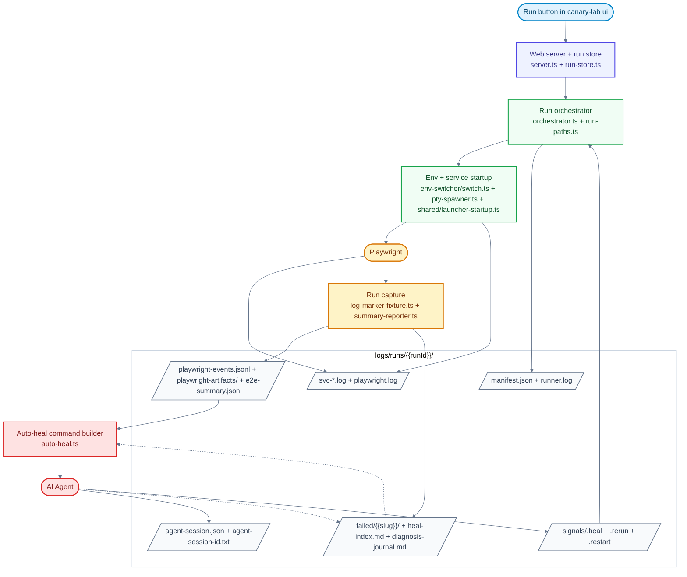

# Canary Lab Architecture

Contributor-facing reference for how the system fits together. This is the canonical
home for mechanisms and invariants: `CLAUDE.md` carries only commands and hard rules,
the `.claude/skills/` workflows carry procedures, and both point here for the "why".
For product intent, see [PRD.md](PRD.md). For user-facing usage, see the
[README](../README.md) and [GUIDE.md](GUIDE.md).

**Contents**

- [Package Model](#package-model)
- [Module Map](#module-map)
- [Run Lifecycle](#run-lifecycle)
- [Concurrency](#concurrency)
- [Heal System](#heal-system)
- [MCP Layer](#mcp-layer)
- [Portify and Benchmark](#portify-and-benchmark)
- [Keep-in-Sync Invariants](#keep-in-sync-invariants)

## Package Model

- One published CLI: `canary-lab`. Main subcommands: `flight` (the front door),
  `init`, `setup`, `ui`, `mcp`, `new feature`, `env`, `boot`, `upgrade`. `fly` is a
  hidden deprecated alias forwarding to `flight`; `agent` is internal.
- Package internals ship as compiled code in `dist/` (built by `npm run build`:
  `tools/gen-agents-md.mjs` → `tools/gen-codex-skills.mjs` → `tools/clean-dist.mjs`
  → `tsc -p tsconfig.build.json` → `tools/prepare-assets.mjs` → Vite build for the
  web UI). The two `gen-*` steps are generators: `AGENTS.md` and the Codex copies of
  the shipped skills are build outputs, not hand-edited files.
- Scaffold templates live in `templates/project/` and are **copied into
  `dist/templates/` during build** by `tools/prepare-assets.mjs`. Editing a template
  without rebuilding does nothing for consumers — `npm run smoke:pack` is the
  packaging-level check.
- The only public import surface for generated projects is
  `canary-lab/feature-support/...` (via `package.json` exports). Everything under
  `apps/` and `shared/` is internal.

### Import aliases are bundler-only

`apps/web` may import across boundaries by alias — `@/…` for `apps/web/src/…`,
`@shared/…` for repo-root `shared/…`. Vite resolves both at bundle time, so no
alias-shaped specifier survives into the output.

**Nothing else in the repo may use them.** The server, CLI, and `shared/` are
emitted by `tsc -p tsconfig.build.json`, and TypeScript does *not* rewrite path
aliases on emit — `package.json` declares no `imports` field, so an aliased
specifier there would ship to `dist/` as a literal `require("@server/…")` and fail
at runtime in the installed package. `tsc` pulls the whole server tree into the
build through `apps/cli/ui-command.ts`, so this covers all of `apps/web-server/`.

Lifting the restriction means adding a resolver (a post-build specifier rewrite, or
Node subpath `imports` plus a `moduleResolution` bump) — not just another `paths`
entry. The three places that must agree for the web aliases are
`apps/web/tsconfig.json`, `apps/web/vite.config.ts`, and `vitest.config.ts` (whose
`projects` entries are standalone configs and each need their own `resolve.alias`).

## Module Map

| Path | What lives there |
| --- | --- |
| `apps/cli/` | CLI entry, scaffold/setup/upgrade/env commands, MCP bridge (`apps/cli/mcp.ts` includes `inferMcpClientKind` client-kind detection) |
| `apps/web-server/src/server.ts` | Fastify app: UI assets, REST routes, WebSocket streams, the `startRun` factory, scheduler wiring |
| `apps/web-server/src/mcp/` | MCP HTTP server (`server.ts`: transports, profile instructions); `tools.ts` builds the profile gate and delegates to `tool-groups/{reads,authoring,run-lifecycle,heal-flow}.ts` (`authoring.ts` composes seven domain siblings); `tool-schemas.ts` holds the input schemas and deps interface, `tool-profiles.ts` the tool-name union and profile arrays, `heal-task-wait.ts` the wait/boot-session steering, `tool-support.ts` the run-resolution and result helpers |
| `apps/web-server/src/features/` | Feature-based modules, each with some of `logic/`, `routes/`, `ws/` subdirs (which ones vary per feature): `runs` (run store, runtime/orchestrator, panes, journal, `logic/heal/` external-heal broker/surface/claim-policy, and `logic/pr/` fix-to-pull-request: preflight, propose, end-of-run auto-propose), `agent-sessions` (agent process, stream, session log/tailer, idle timer), `coverage` (coverage ledger, PRD extractor, verification), `flights` (flight store, conductor/drive loop, per-stage adapters), `wizard` (draft records for external authoring sessions, tests-draft route — read/track only; the internal plan→spec agents were retired in favour of the flight pipeline), `evaluation` (export archive/store, test-review export, localized-rewrite agent), `config` (feature/project config authoring, AST, dotenv), `portify`, `benchmark`, `version` (npm-registry update check) |
| `apps/web-server/src/shared/` | Web-server-local shared infra: `git-repo`, `gh-cli`, `ring-buffer`, `simple-zip`, `toon`, `workspace-events`, `editor-launch`, `open-browser`, `prompts` (the `.md` template loader), `feature-loader`, `launcher-startup` (service startup + health probes), `config-ast`, `ast-extractor` (the Playwright tag/assertion parser the coverage ledger reads), and `ws/workspace-stream` |
| `apps/web-server/src/features/runs/logic/runtime/` | The run orchestrator and its modules (see [Run Lifecycle](#run-lifecycle) and below) |
| `apps/web/` | React UI (Vite, Tailwind) |
| `shared/e2e-runner/` | Playwright fixture support (`log-marker-fixture`, summary reporter) |
| `shared/configs/` | Base Playwright config and env loader |
| `shared/runtime/` | Shared project-root resolver |
| `templates/project/` | Scaffolded workspace files. `demo-app/` is the one full-Flight demo: a bare product repo with catalog, inventory, and checkout services plus one ordered requirements document. No feature ships around it, so a tester starts at Repo scan instead of inheriting completed stages. Each service contains one contract defect; the end-to-end journey exposes them in dependency order so a successful Run records three repair cycles and changes in all three service directories. |
| `tools/` | Build/publish utilities: `gen-agents-md`, `gen-codex-skills`, `clean-dist`, `prepare-assets`, `smoke-pack`, `smoke-demo`, `publish-package`, `generate-changelog`, `tag-release`, `fix-node-pty-permissions`, plus the two repo gates `check-feature-boundaries` and `check-conventions`. `tools/fixtures/demo-storefront-feature/` is contributor-only evidence for the deterministic demo smoke; it is not copied into consumer workspaces. |

**Web `cleanup` has no server twin, on purpose.** The `apps/web/src/features/cleanup`
feature consumes `/api/cleanup/*`, but those routes stay with the features that own
the data being deleted — `/api/cleanup/runs` and `/api/cleanup/worktrees` in
`features/runs/routes/runs-cleanup-routes.ts`, `/api/cleanup/portify` in
`features/portify/routes/portify.ts`. Do not go looking for a `cleanup` server
feature, and do not create one: it would pull run and portify deletion away from the
stores that back them, for nothing but symmetry. The web side is named after the API
surface it consumes so the two are greppable together. (In the UI this is the
**Cleanup** pill, with three tabs — Runs, Worktrees, Portify.)

Key `apps/web-server/src/features/runs/logic/runtime/` modules:

| Module | Role |
| --- | --- |
| `orchestrator.ts` | Single-run lifecycle: env apply, service boot, Playwright run, heal cycles, manifest/journal writes |
| `pty-spawner.ts` (+ `apps/web-server/src/shared/launcher-startup.ts`) | Service startup, health probes (HTTP/TCP), PTY capture |
| `launcher/interpolate.ts` | Token resolution — the reserved `${port.<slot>}` namespace |
| `port-allocator.ts` | Per-run free-TCP-port allocation per declared port slot |
| `admission.ts`, `run-scheduler.ts` | Resource-aware admission + FIFO queue promotion |
| `repo-collision.ts`, `repo-worktree.ts` | Same-repo collision detection + per-run git worktree isolation |
| `auto-heal.ts` | Local heal-agent binary resolution and spawn command building |
| `heal-cycle.ts`, `heal-prompt-builder.ts` | Heal-cycle state machine and prompt assembly |
| `manifest.ts`, `run-paths.ts`, `run-id.ts` | Run manifest schema and path/id conventions |
| `summary-reporter.ts`, `log-enrichment.ts`, `trace-enrichment.ts` | Evidence capture and enrichment |
| `features/portify/logic/runtime/` | Agent-driven port-injection workflow, now its own feature (see [Portify](#portify-and-benchmark)) |
| `features/benchmark/logic/runtime/` | Multi-arm self-heal benchmarking, its own feature (retired in 1.0.0, **revived in 1.3.0** as a preview behind `?showBenchmark=true`) |
| `apps/web-server/src/features/coverage/logic/coverage/` | Coverage ledger: PRD summarization (`prd-summary.ts`), docs collection (`docs-collection.ts`), breadth computation (`ledger.ts`), strictness grading (`strength.ts`), and the shared service both REST and MCP call (`service.ts`). Shared output types live in `shared/coverage/types.ts`. See [Requirement Coverage](#requirement-coverage). |

### Feature boundaries and per-feature layout

The two apps share an **eight-feature spine** — `runs`, `coverage`, `flights`,
`wizard`, `evaluation`, `config`, `portify`, `benchmark` — with three deliberate
asymmetries: the server also has `agent-sessions` and `version`, and the web also
has `cleanup` (see above). Ten server features, nine web ones. Note that
`agent-sessions` is server-only *now*: its web half (`AgentSessionView` and the
session socket) moved to `apps/web/src/shared/` in Phase 9, since six features
render agent output. The two sides enforce the taxonomy differently.

**Server features are registrars, not re-export barrels.** Each
`apps/web-server/src/features/<name>/index.ts` exports `register(app, ctx)` and
returns a handle other features consume — `runs` returns
`{ scheduler, attachRunStreams, restartExternalRun }`, which `benchmark`,
`coverage` and the MCP mount all take. Don't turn one into a re-export barrel;
`server.ts` depends on the register/handle contract.

**Web features are re-export barrels.** Each
`apps/web/src/features/<name>/index.ts` names that feature's public surface. A
feature may import another only through its barrel, never a path inside it:

```
✔  import { RunRow } from '@/features/runs'
✘  import { RunRow } from '@/features/runs/components/RunRow'
```

`npm run check:boundaries` enforces this and fails on three things: a deep
cross-feature import, a feature that is consumed but has no barrel, and a stale
entry in its `ALLOWED_DEEP` allowlist. The allowlist exists because routing
**both** directions of a mutually-dependent pair through barrels is an ESM
module-init cycle; `coverage ⇄ flights` is the one surviving pair (the flight
page embeds coverage's docs rail, the coverage page renders flight stage chips).
Shrink that list, don't grow it.

**Two shared aliases, easily confused.** `@shared/` is the repo-root `shared/`
package (published types, shared with the CLI). `@/shared/` is the web app's own
`apps/web/src/shared/`. A lint or codemod written against the wrong one passes
while enforcing nothing.

**Which subdirs a feature has is deliberate, not uniform.** `logic/` is
universal on the server; `routes/` and `ws/` exist only where the feature serves
HTTP or streams. On the web, `components/` is universal while `state/`, `api/`,
`lib/` and `utils/` appear only where needed — web `config` is ~6,000 lines of
components with no state or api layer, and that is correct. A feature with no
realtime surface should **not** carry an empty `ws/`.

**When a module belongs in `shared/`, not a feature.** If two or more features
import it and it imports no feature itself, it is infrastructure that was filed
wherever it was first needed. Phase 9 moved five such modules out of `apps/web`
features (`atoms.tsx`, `AgentSessionView`, `agent-session-socket`,
`workspace-socket`, `ExternalAgentCard`, `external-client-branding`), which cut
cross-feature imports from 57 to 20 — and all but 2 of those now go through a barrel. Note that `apps/web/src/shared/api/**` and
`shared/lib/**` are inside the coverage gate while `features/*/api/**` is not —
moving a module there brings it into the gate and it must reach 100%.

## Run Lifecycle

Code path for a run started from `canary-lab ui`:


```mermaid
%%{init: {"theme": "base", "themeVariables": {"fontFamily": "Inter, ui-sans-serif, system-ui, sans-serif", "primaryTextColor": "#0f172a", "lineColor": "#64748b", "clusterBkg": "#ffffff", "clusterBorder": "#cbd5e1"}}}%%
flowchart TD
    user(["Run button in canary-lab ui"])
    web["Web server + run store<br/>server.ts + run-store.ts"]
    runtime["Run orchestrator<br/>orchestrator.ts + run-paths.ts"]
    setup["Env + service startup<br/>env-switcher/switch.ts + pty-spawner.ts + shared/launcher-startup.ts"]
    playwright(["Playwright"])
    capture["Run capture<br/>log-marker-fixture.ts + summary-reporter.ts"]
    autoheal["Auto-heal command builder<br/>auto-heal.ts"]
    agent(["AI Agent"])

    subgraph runDir["logs/runs/{{runId}}/"]
        state[/"manifest.json + runner.log"/]
        logs[/"svc-*.log + playwright.log"/]
        evidence[/"playwright-events.jsonl + playwright-artifacts/ + e2e-summary.json"/]
        healctx[/"failed/{{slug}}/ + heal-index.md + diagnosis-journal.md"/]
        session[/"agent-session.json + agent-session-id.txt"/]
        signals[/"signals/.heal + .rerun + .restart"/]
    end

    user --> web --> runtime --> setup --> playwright
    runtime --> state
    setup --> logs
    playwright --> logs
    playwright --> capture
    capture --> evidence
    capture --> healctx
    evidence --> autoheal
    healctx -.-> autoheal
    autoheal --> agent
    agent --> session
    agent -.-> healctx
    agent --> signals
    signals --> runtime

    classDef entry fill:#e0f2fe,stroke:#0284c7,color:#0c4a6e,stroke-width:2px
    classDef core fill:#eef2ff,stroke:#4f46e5,color:#312e81,stroke-width:2px
    classDef runtime fill:#f0fdf4,stroke:#16a34a,color:#14532d,stroke-width:2px
    classDef test fill:#fef3c7,stroke:#d97706,color:#78350f,stroke-width:2px
    classDef heal fill:#fee2e2,stroke:#dc2626,color:#7f1d1d,stroke-width:2px
    classDef artifact fill:#f8fafc,stroke:#64748b,color:#334155,stroke-width:1.5px

    class user entry
    class web core
    class runtime,setup runtime
    class playwright,capture test
    class autoheal,agent heal
    class state,logs,evidence,healctx,session,signals artifact
```

In prose: the `startRun` factory in `apps/web-server/src/server.ts` admits/queues the run
(see [Concurrency](#concurrency)), isolates every repo in a per-run worktree (see
[Always-worktree runs](#always-worktree-runs-r80)), then `orchestrator.ts` applies the
selected envset, boots services through the launcher/PTY layer (each service's PTY output
is captured programmatically into `svc-<name>.log` — never echoed to the server's stdout),
runs Playwright, and captures evidence. On failure, the run either spawns a local heal agent
(`auto-heal.ts`) or parks for an external client (see [Heal System](#heal-system)).
The agent fixes code and drops a `rerun`/`restart` signal; the orchestrator continues
the same run until pass or terminal failure. At teardown the agent's edits are diffed out
of each worktree into `<runDir>/fixes/` before the worktree is released, and a run that
healed green proposes that diff as a draft pull request (see
[End-of-run pull request](#end-of-run-pull-request)).

### Logging and retention

Logs live under `<workspace>/logs/`. Per-run artifacts are in `logs/runs/<runId>/`:
`runner.log` (orchestrator narration), `svc-<name>.log`, `playwright.log`,
`external-commands.jsonl` (per-command audit for external heal), `fixes/` (the captured
heal diff), failure slices, and the manifest. There is no automatic retention/pruning —
runs persist on disk until removed manually via the Cleanup page's **Runs** tab
(`GET /api/cleanup/runs`, backed by `RunStore.delete` / `trimArtifacts`), which deletes
whole runs or trims Playwright artifacts while keeping the manifest and `runner.log`.

## Concurrency

Multiple runs can be active at once (since 1.2.0). The top-right **Runs** dialog in
`canary-lab ui` lists every run (running/healing/queued/finished).

### Per-run ports

A `startCommand` declares `ports: [{ name: 'api', env: 'PORT' }]` (env optional). The
orchestrator allocates a free TCP port per slot per run
(`apps/web-server/src/features/runs/logic/runtime/port-allocator.ts`), injects it as the service's `env`
var (`PORT`), exposes it to config via the reserved token `${port.api}`, and to the
Playwright process as `CANARY_PORT_<shell-safe-slot>`. Config tokens keep the slot
name verbatim, while Playwright's environment key replaces every character outside
letters, digits, and `_` with `_` (`checkout-service` →
`CANARY_PORT_checkout_service`) because interactive shells drop invalid environment
names. Slots that collide after normalization are rejected before Playwright starts.

`${port.<slot>}` resolves in **three places** (the `port` token namespace lives in
`apps/web-server/src/features/runs/logic/runtime/launcher/interpolate.ts`):

1. the **command** (`--port ${port.api}`),
2. the **`healthCheck`** URL,
3. at apply-time, inside **applied envset files** (`.env`/`.properties`/`.env.local`)
   via `applySet`'s resolver (`resolvePortTokens`).

So inter-service URLs and config-file listen ports (e.g. Spring
`server.port=${port.api}`, `dev.url=http://localhost:${port.web}`) follow the
run's allocation. Test helpers resolve the target as
`CANARY_PORT_api → GATEWAY_URL → hardcoded default` (see
`tools/fixtures/demo-storefront-feature/e2e/helpers/api.ts`). The CLI `env`
switching path passes no resolver, so it stays a verbatim copy.

### Always-worktree runs (R80)

**Every `executionType: 'run'` isolates every one of the feature's repos in a per-run
`git worktree`** under `<runDir>/worktrees/` — not just colliding ones, and not only
when the user asks. Set in `runs-route-deps.ts` (`alwaysWorktree = executionType === 'run'`).
Each worktree is cut from `HEAD`, gets the source repo's `node_modules` symlinked in
(`linkNodeModules` — a bare worktree skips gitignored deps and the boot command dies at
exit 127, which then reads as a health-check timeout), and has the user's uncommitted
changes replayed into it (`hydrateWorkingTreeDiff`), so the run tests their WIP rather
than committed state. A repo that can't be worktree'd falls back to running in place with
a warning; a **portified** repo that can't be worktree'd fails the run loudly, because its
overlay could not apply and it would boot un-portified.

The point is fix capture. `captureFixBaseline` stashes a baseline ref after
overlay + envset + WIP hydration, so the teardown diff is exactly the repair; `captureFixes`
writes it to `<runDir>/fixes/<repo>.patch` + `fixes.json` + `manifest.fixCapture` before the
worktree goes away. **The heal agent never mutates the product repo's working copy** — its
edits reach the user as a patch file and, on a green healed run, as a draft pull request
pushed from a throwaway worktree (see [End-of-run pull request](#end-of-run-pull-request));
HEAD and the checkout are left exactly as they were, though the repo does gain the fix
branch ref. Non-portified worktrees are removed at teardown; a portified run reverses
its overlay but *keeps* the worktree (it holds the repair, and the Cleanup page's Worktrees
tab owns its lifecycle). Boot, verify and benchmark sessions keep the older
portified/collision-only behaviour — they don't heal, so there is nothing to capture.

### Same-repo collision

Worktrees isolate the *working tree*, not the feature's **fixed ports** — so two runs of the
same feature still can't boot side by side unless it has been port-ified. Starting a second
run on an active repo therefore returns `repo_collision_requires_choice` (REST 409 / MCP
result) and the user chooses **worktree** (run now) or **queue** (wait for the conflicting
run to finish). Different-repo runs never collide, and a portified feature auto-isolates with
no prompt at all — its overlay gives each boot disjoint injected ports, which makes it
inherently collision-free. See
`apps/web-server/src/features/runs/logic/runtime/repo-collision.ts` + `repo-worktree.ts`.

### Admission and queue

Runs beyond a CPU/free-RAM heuristic are parked as `queued` (status `queued`, with
`manifest.queueReason`) and promoted FIFO on run-end. Optional hard ceiling via env
`CANARY_MAX_CONCURRENT_RUNS`. The scheduler is
`apps/web-server/src/features/runs/logic/runtime/run-scheduler.ts` (decision logic in `admission.ts`);
it's wired into the `startRun` factory in `server.ts` and promotes on the RunStore
`finalized` event.

### Multi-service limits (what concurrency can't auto-fix)

Worktree isolation covers concurrent heal *edits*, not *ports* — two runs of the same
multi-service app still can't both boot, so they queue. Apps that hardcode a port in
source (ignoring `PORT`/`--port`/config) can't be relocated — that's what
[Portify](#portify-and-benchmark) fixes. OAuth issuer + redirect URIs are
pre-registered with the provider for a fixed host:port, so OAuth features (e.g.
`shop_oauth`) run one at a time regardless of any rewiring. The `${port}` envset
resolver unlocks *different* multi-service features running concurrently (each gets
distinct ports) and cleaner single multi-service runs — not same-app concurrent
isolation.

## Heal System

### Local auto-heal

With `healAgent: 'claude'|'codex'|'auto'`, the orchestrator spawns a local agent CLI.
The agent's **absolute path** is resolved by `resolveAgentBinary`
(`apps/web-server/src/features/runs/logic/runtime/auto-heal.ts`): explicit override
(`CANARY_LAB_CLAUDE_BIN` / `CANARY_LAB_CODEX_BIN`) → `which` (PATH) → well-known
locations (`~/.local/bin`, homebrew, `/usr/local/bin`, npm-global, pnpm, nvm
`node/*/bin`). The resolved path is threaded into `buildAgentSpawnCommand` as
`binaryPath` so the agent spawns even when the UI server was launched with a minimal
PATH (e.g. by Claude Desktop, which omits `~/.local/bin`). Without this, `which claude`
fails under a Desktop-spawned server → `healMode: None` → run fails with no heal.
`binaryPath` is omitted in unit tests (they assert the bare `claude`/`codex` command).
`heal-cycle.ts` tracks cycle state; `heal-prompt-builder.ts` assembles each cycle's
prompt.

Before the spawn, `ensureHealWorkspaceTrusted` settles Claude Code's folder-trust
prompt for the project root — see the [invariants table](#keep-in-sync-invariants).
The repair agent is the only one canary spawns on an interactive TTY, so it is the
only one that prompt can stop, and under autopilot nobody is there to answer it.

The model is the agent's own default. `CANARY_LAB_HEAL_MODEL` pins it for one server
(`healModelsFromEnv`, `agent-sessions/logic/agent-models.ts`) — read once at boot.
That override exists to **demonstrate** the loop: on the strongest model the repair
agent reads the whole service and fixes every defect in one pass, which is a good
outcome that shows none of the try / rerun / try again the loop is for. The default
must stay agent-default — repair is the product.

### External heal

When `manifest.healMode === 'external'` the orchestrator parks at
`waiting-for-signal` and an MCP client drives `claim_heal` → `get_heal_context` →
edit code → `signal_run`. `ExternalHealBroker`
(`apps/web-server/src/features/runs/logic/heal/external-heal-broker.ts`) owns the single-claim
lock and reclaims a claim whose heartbeat has gone stale — `HEARTBEAT_STALE_MS` in
`shared/run-state.ts`, currently **10 minutes**, long enough that a client thinking between
tool calls is never evicted. Every external command is audited at
`<runDir>/external-commands.jsonl`.

### Heal-claim policy (block runner PTYs)

Every **interactive** client kind may *own* a heal claim: `claude`, `codex` (Desktop
and CLI both collapse to these — we no longer distinguish), and even undetected
`other` (assumed to be a person at a terminal). The only kinds blocked are the
runner-spawned PTY agents — `claude-pty`, `codex-pty` — which Canary Lab itself spawns
(benchmark sabotage, portify, …); letting one claim heal would have it claim its own
run. It's a **denylist** (`apps/web-server/src/features/runs/logic/heal/heal-claim-policy.ts`,
`isHealClaimAllowed`), because the dangerous case is the one we fully control: the
runner tags its spawns `*-pty` deterministically via `CANARY_LAB_MCP_CLIENT_KIND`
(set in `runAgentProcess`), so we never rely on heuristic detection to block it —
everything else fails *open* so a person can always heal. Override via
`CANARY_LAB_HEAL_CLAIM_BLOCKED_CLIENTS` (comma-separated kinds). Enforced at two layers:

1. a hard backstop in `broker.claim()` (covers `claim_heal`, REST `/claim`, the
   reclaim helper → returns `client-kind-not-allowed`), and
2. the `start_run` handler / `POST /api/runs` (which build the session bypassing the
   broker → return `claimSuppressed: true` and omit the heal-wait next-step instead
   of claiming).

Client kind is heuristically detected from process lineage in `apps/cli/mcp.ts`
(`inferMcpClientKind`).

**Trigger source decides the heal mode** (not the claim). Any run started by an MCP
client is *external-origin* and uses External‑client heal **regardless of the project
`healAgent` setting** — that setting governs only **UI/REST‑triggered** runs. The
`server.ts` `startRun` closure splits two flags: `externalOrigin`
(`healAgentReq.kind === 'external'`) disables project auto‑heal and forces
`externalHeal` mode; `canClaim` (`externalOrigin && claimable !== false`, i.e. an
interactive client) is what actually creates the `externalHealSession` + broker claim. So a
non‑claiming MCP client (a runner PTY agent) passes `claimable: false`: the run enters
external mode with **no** session and **waits** for an interactive/UI drive — it does *not*
fall back to a locally‑spawned auto‑heal agent. A PTY restart of a failed run follows
the same path (`restartExternalRun` with `claimable: false`) rather than being refused.

### Handoff

`handoff_heal`: active runs can only hand off to `manual` (the orchestrator can't add
a local autoHeal mid-flight); `auto`/`claude`/`codex` require a failed/aborted run.

### End-of-run pull request

A run that healed green does not stop at the patch file. `autoProposeFixes`
(`apps/web-server/src/features/runs/logic/pr/auto-propose.ts`) runs right after
`captureFixes` in the orchestrator's teardown and opens a **draft** pull request per repo,
so an unattended overnight repair leaves a review thread rather than a patch nobody knows
about. `shouldAutoPropose` is deliberately narrow, because a push is the one step here that
leaves the machine and can't be taken back: `executionType: 'run'` only (boot, verify and
benchmark sessions never heal), `status === 'passed'` only (a loop that gave up produced a
fix that did *not* work), `healCycles > 0`, and a non-empty `fixCapture`. Consent is the
workspace setting `autoProposePr` in `canary-lab.config.json` — default **on**, defaulted
and parsed in
`apps/web-server/src/features/runs/logic/runtime/launcher/project-config.ts`, validated on
write in `apps/web-server/src/features/config/routes/project-config.ts`, toggled under
Settings → GitHub. A `RunContext` with no `projectRoot` has no config to read, so it never
pushes.

`proposeFixesForRun` (`apps/web-server/src/features/runs/logic/pr/propose-fixes.ts`) is the
single mechanism behind both the automatic trigger and the user's own **Propose PR** dialog
(`POST /api/runs/:runId/propose-pr`); only the `draft` flag differs. The working copy is
still never touched: the patch is applied in a throwaway worktree cut from the captured
`baseSha`, committed, force-pushed, and turned into a PR by `gh`, whose own credential does
the push — Canary Lab never handles a token. What the product repo *does* gain is the fix
branch ref and its remote-tracking ref. The branch is scoped to **feature + repo**
(`fixBranchName(feature, repoName)` → `canary-lab/fix-<feature>-<repo>`), not to the run, so
healing the same feature three times updates ONE pull request instead of opening three. That
makes the order load-bearing: the push happens FIRST and an existing PR is looked up only
afterwards, so a reviewer never opens a stale earlier attempt.

Failure is recorded, never raised — a run's verdict must not depend on GitHub being
reachable. Every outcome, success and failure, lands on `manifest.prAttempt` (`RunPrAttempt`
in `shared/run-state.ts`: `at`, `auto`, and a per-repo `{ ok, url?, reason? }`), written
through `stateSink.patchManifest` so the runs WebSocket pushes it live; successes also merge
into `manifest.proposedPrs`. The web **Changes** tab
(`apps/web/src/features/runs/components/ChangesTab.tsx`, a tab of `RunDetailColumn`, disabled
rather than hidden when a run changed nothing) renders the captured diff per repo — served as
text by `GET /api/runs/:runId/fixes/:repoName/patch`, which 404s when the run captured nothing
for that repo and 410s once the Cleanup page trimmed the run directory away — next to the PR
link, or the per-repo reason there is none.

## MCP Layer

- The MCP HTTP server mounts at `localhost:<port>/mcp` (streamable HTTP) inside
  `canary-lab ui`. Health: `GET /mcp/health?profile=<p>`. The port is configured in
  `canary-lab.config.json` (`port` field) in the workspace directory — read it
  dynamically rather than assuming a fixed value (default 7421 if unset).
- **Profiles** pick the tool subset via `?profile=`. Nine of them, six workflow-scoped
  plus three composed: `repair` (heal loop), `verify` (verification configs), `author`
  (feature/envset/draft authoring), `coverage` (docs → PRD summary → ledger), `export`
  (evaluation archives), `flight` (the conducted pipeline), `portify` (port-injection
  workflow) — then `lifecycle` (**the default**: repair + verify + author + coverage +
  export + flight, no portify) and `full` (lifecycle + portify). `coverage`, `export`
  and `flight` were carved out of what used to be one oversized `author` array; the
  composed unions absorbed the split, so nothing had to move twice. Optional
  `?client_kind=claude|codex|other|...` (the `*-pty` kinds are set by the runner, not passed by clients).
- Tools live in `apps/web-server/src/mcp/tool-groups/` — one module per domain
  section (`reads`, `authoring`, `run-lifecycle`, `heal-flow`), each a thin wrapper
  over existing REST routes/helpers. `start_run`/`write_envset`/etc. reuse handlers
  via `app.inject()`; don't duplicate orchestrator logic. Author-profile tools call
  `apps/web-server/src/features/config/logic/feature-authoring.ts` directly.
  `tools.ts` itself only builds the profile gate and calls the four registrars.
  The grouping is **by domain, not by profile** — seven tools (`list_features` in
  six) belong to several profiles at once, so profile membership is data in
  `tool-profiles.ts`, never file layout.
- Profile membership = the `REPAIR_TOOLS`/`VERIFY_TOOLS`/`AUTHOR_TOOLS`/`COVERAGE_TOOLS`/
  `EXPORT_TOOLS`/`FLIGHT_TOOLS`/`PORTIFY_TOOLS` arrays, which live in
  **`mcp/tool-profiles.ts`** and reach the rest of the layer re-exported through
  `tool-support.ts`. `LIFECYCLE_TOOLS` auto-dedupes the union of all six non-portify
  arrays + `FULL_ONLY_TOOLS` (`get_run_actions`, `claim_heal`, `release_heal`);
  `FULL_TOOLS` is `LIFECYCLE_TOOLS` + `PORTIFY_TOOLS`. Because both are computed
  unions, adding a tool to any workflow array surfaces it in the composed profiles
  with no second edit. Adding/moving a tool does still require updating the mirror
  arrays in `mcp/server.smoke.test.ts` — see the
  [invariants table](#keep-in-sync-invariants) and the `cl_add-mcp-tool` skill.
- Each MCP session gets its own transport (`mcp/server.ts`) — a singleton would
  reject the 2nd client with `-32600 Server already initialized`.
- Destructive tools gate on `confirm: z.literal(true)` in their input schema
  (e.g. `abort_run`, `write_envset`).
- **Steering skill-less clients**: external clients act on the `initialize`
  instructions + tool *results*, not the Canary Lab skill. The server sends
  profile-aware `instructions` (`INSTRUCTIONS_BY_PROFILE`, `mcp/server.ts`); `repair`
  carries the External Run Loop. `start_run`/`signal_run` results add
  `nextSteps: ['wait_for_heal_task']` (`healWaitNext`, `mcp/heal-task-wait.ts`) so a
  result-driven agent blocks on `wait_for_heal_task` instead of polling
  `get_run_snapshot`. Following or waiting on a **boot-only run**
  (`executionType: 'boot'`, started via `boot_services`) instead returns
  `type: 'boot_session'` (`bootSessionValue`/`isActiveBootRun`, `mcp/heal-task-wait.ts`) from
  `start_run` and `wait_for_heal_task` — no heal claim, no `healWaitNext`, and
  `wait_for_heal_task` returns immediately rather than dead-waiting until timeout. A
  `passed` result additionally carries a `fix` block (`healFixOutcome`,
  `mcp/heal-task-wait.ts`) — per repo: files changed, plus the draft-PR url or the
  `noPrReason` there is none — whose `note` tells the client not to open or push one of its
  own. It has to ride the *result*: `REPAIR_INSTRUCTIONS` never mentions the pull request at
  all, so a skill-less client would otherwise push a duplicate branch on top of the one the
  run just opened.
- **Feature docs convention**: feature-scoped prose (distilled sessions, plans,
  notes) lives at `features/<name>/docs/<slug>.md`. The `write_feature_doc` MCP tool
  (`coverage` / `flight` / `lifecycle` / `full` profiles — **not** `author`) is the only
  sanctioned writer — create-or-replace, markdown only, path-traversal hardened, with
  `link_path` to symlink a local file in place instead of copying it. The draft-apply
  path rejects non-spec files, so docs do NOT go through it.

## Portify and Benchmark

**Portify** (`apps/web-server/src/features/portify/logic/runtime/`, ~16 files) is an agent-driven
workflow that rewrites a feature's services so every network listener reads an
injected port, proven by a concurrent double-boot — making the feature eligible for
concurrent runs and benchmark arms. Two execution models, split by who initiates
(see "Internal vs external execution" under Requirement Coverage — the same rule):
the **GUI** spawns a local agent (`startPortify`/`revise`, REST only) that streams
through `AgentSessionView`; **MCP clients** drive it themselves
(`start_external_portify` → in-place edits → `submit_external_portify`, the
re-edit+re-submit loop replacing `revise`) and the GUI shows `ExternalPortifyPanel`.
Both converge on `get_portify` (`editing → verifying → ready-to-save`) →
`save_portify`/`cancel_portify`. The two prompts that carry the internal agent
through a second pass have external equivalents so the surfaces stay level: a
failed double-boot re-parks at `editing` and `get_portify` rides the rendered
`portify-retry.md` back as `prompt`; a human asking for a change after
verification calls `revise_external_portify(workflowId, feedback)`, which reopens
the same worktree (`orchestrator.reopenExternal`) and returns
`portify-feedback.md` — the point being that `cancel_portify` would discard a
verified worktree that the client would then have to rebuild from scratch. One workflow **per feature** (a second start on the
same feature is a 409); different features port-ify concurrently up to a global
resource cap — `portifyConcurrencyCap()` reuses the run loop's `computeSlotBudget`
heuristic, with an optional manual ceiling via env `CANARY_MAX_CONCURRENT_PORTIFY`
(mirrors `CANARY_MAX_CONCURRENT_RUNS`). Over the cap, a start returns 429 (no queue —
the caller waits/retries). `list_portify_status` shows which features have a saved overlay.

**Ephemeral overlay model** (the source edits never touch the product repo): the
agent edits source in a throwaway scratch worktree and the verified diff is captured
as a per-repo patch under `features/<feature>/portify/` (`overlay.ts`: `writeOverlay`/
`readOverlay`/`overlayExists`/`checkStaleness`). `save_portify` writes the overlay and
discards the scratch worktree — nothing is committed or merged. At RUN time every repo is
already worktree-isolated (see [Always-worktree runs](#always-worktree-runs-r80); for a
portified feature this is non-negotiable rather than best-effort — a repo that can't be
worktree'd fails the run). The orchestrator `applyOverlay`s the
patch (plain `git apply`, `--3way` fallback) before boot after a staleness check, and
`reverseOverlay`s it (atomic `git apply -R`) at teardown while KEEPING the worktree
(it holds heal edits). Apply/staleness failure aborts the run loudly ("re-run Portify")
— it never boots un-portified. The feature-config `ports` slots + envset tokenization
the agent also writes are PERMANENT (Canary Lab reads the slots in `allocateRunPorts`
before the overlay applies), so only the product-repo source is ephemeral.

**Cross-feature reuse** (the overlay is filed per feature but the patch belongs to a
git ROOT): at setup `buildSiblingOverlayIndex` (`portify-worktree-borrow.ts`) indexes
every OTHER feature's non-empty patches by resolved git toplevel, `pickBorrowable`
prefers an exact base-SHA match then the newest capture, and the winner is
`applyOverlay`-ed into the scratch worktree AFTER the diff baseline — so the borrowed
lines flow into THIS feature's own captured overlay (self-contained, no pointer back to
the source feature). A conflict resets the worktree and the agent starts from scratch;
borrowing is an optimization, never fatal. What does NOT travel is the config half: the
`ports` slots are per feature, so each overlay ALSO records the slots its feature
declared (`OverlayRepo.ports`) purely as a hint — `buildSeededNote` hands that list to
the borrowing agent/client, which confirms it against the start commands THIS feature
boots (a differently-booted stack can bind a listener the source feature never did)
instead of re-deriving it from the diff. When the borrowing feature already declares
every recorded slot there is nothing left to edit at all, and `start_external_portify`
begins the double-boot itself (`seededSlotsAlreadyDeclared`) rather than waiting for a
submit — the internal path has the equivalent attempt-0 gate in `orchestrator.run()`.
The concurrent double-boot stays the only proof on every path. Because a borrowed patch
lands in features that may not boot the same peers, `portify.md` requires every port
rewrite — listener AND inter-service client — to keep its original value as a fallback,
so an un-injected peer is dialled exactly where it always was.

**Benchmark** (`apps/web-server/src/features/benchmark/logic/runtime/`, ~10 files) runs multi-arm
self-heal benchmarking (race/sabotage verification) — measuring how the repair loop
performs vs running tests without Canary Lab. The product surface was retired in 1.0.0
and **revived in 1.3.0** as a preview (groundwork for pluggable harnesses), gated behind
`?showBenchmark=true`. UI: `BenchmarkWindow`/`BenchmarkPill` (`apps/web/src/features/benchmark/`);
internal-only (no MCP tools); the sabotage agent streams through `AgentSessionView`.

## Requirement Coverage

The coverage ledger (`apps/web-server/src/features/coverage/logic/coverage/`) computes two
facts about a feature's tests as math over the tags — never an agent's opinion:

- **Breadth** — which PRD requirements have a mapped test. Source docs in
  `features/<feature>/docs/` are summarized into a `_prd-summary.json` sidecar of
  `Requirement`s (`prd-summary.ts`; agent-proposed, deterministic heading-extraction
  fallback). Tests link to requirements via `@req-<id>` / `@path-*` / `@variant-*` tags on
  the `test()` (legacy `@requirement` / `@path` comments parse too), extracted by
  `apps/web-server/src/shared/ast-extractor.ts`. `ledger.ts` joins these into per-requirement gap types
  (`covered` / `path-incomplete` / `variant-incomplete` / `untested`) and the coverage %.
  Coverage is **decoupled from runs**: it asks "does a mapped test claim every path (and
  variant) this requirement implies?", never "did a run pass?".
- **Depth (strictness)** — how strict each covering test is. `strength.ts` classifies every
  assertion snippet (collected by `ast-extractor.ts`) into a stack-layer tier (log → 1,
  DB/state → 2, app API/UI → 3, browser-at-real-destination → 4) by structural heuristics
  (no agent), grades the test `shallow` / `basic` / `solid` / `strong`, and surfaces a
  `suggestedStrongerCheck`.

`service.ts` is the single computation layer; `routes/coverage.ts` (REST) and the
`get_feature_coverage` / `list_feature_docs` MCP tools both call it, so the UI and an
agent can't diverge. The agent's role is bounded to *generate and map* (summarize docs,
map tests → requirements); canary *computes* the %, the gaps, and the tiers.

**Internal vs external execution.** Both PRD summarization and the annotate-pass
(mapping tests → requirements) have two execution models, split by who *initiates* the
work — the project-wide rule. **Internal / server-spawned** is the **GUI's REST route**
(`POST /api/features/:name/{prd-summary/regenerate,coverage/jobs}` → `startCoverageJob`/
`regeneratePrdSummary`): canary spawns its own `claude`/`codex` CLI
(`prd-summary.ts` / `annotate-engine.ts`) and streams it through `AgentSessionView`.
**External / offloaded** is the **entire MCP surface** — there is no server-spawned MCP
tool: `start_external_summary` → `submit_external_summary` and `start_external_coverage`
→ `submit_external_coverage` (`jobs/external.ts`) spawn **no** LLM, hand the calling
client the prompt/context (`buildSummaryAuthoringContext` / `buildCoverageMappingContext`,
reusing the internal prompts), and canary writes the result through the canonical writers
(`applyExternalSummary` via the shared `assembleSummary`; `applyExternalCoverageMappings`
via the tag-writer) and recomputes. Such jobs carry `producer: 'external'`, have no
`sessionRef`, and render monitor-only (`ExternalAgentCard`) in the Generating pane. Both
models feed the *same* deterministic ledger recompute, which is producer-agnostic (it
only reads on-disk tags). The single
highest-risk invariant is **requirement-id stability across PRD regeneration** —
`reconcileRequirementIds` (in `prd-summary.ts`) preserves a surviving requirement's id
(by echoed id or exact title match) and carries dropped ones as `deprecated`, because a
renumber would silently break every inline `@requirement` annotation.

## Keep-in-Sync Invariants

The canonical table. Each row is a set of files that must change together — nothing
enforces some of these except tests and discipline, so the owning skill encodes the
procedure.

| Invariant | Files involved | Enforced by | Owning skill |
| --- | --- | --- | --- |
| MCP tool ↔ profile membership | `apps/web-server/src/mcp/tool-profiles.ts` (`REPAIR_TOOLS`/`VERIFY_TOOLS`/`AUTHOR_TOOLS`/`PORTIFY_TOOLS`/`FULL_ONLY_TOOLS`) ↔ mirror arrays in `apps/web-server/src/mcp/server.smoke.test.ts` | `npx vitest run apps/web-server/src/mcp/server.smoke.test.ts` | `cl_add-mcp-tool` |
| Run-loop semantics across agent surfaces | `INSTRUCTIONS_BY_PROFILE` (`apps/web-server/src/mcp/server.ts`) ↔ result steering (`healWaitNext`, `bootSessionValue` in `mcp/heal-task-wait.ts`) ↔ the shipped run-loop skills — **enumerate them, don't assume** (`find agent-integrations -name SKILL.md`; the loop lives in `canary-lab-run/`, not the umbrella `canary-lab/`) | nothing automated — discipline only | `cl_sync-agent-surfaces` |
| Boot-session / collision / queue / claim semantics | `start_run` + `wait_for_heal_task` result shapes (`mcp/tool-groups/`) ↔ instructions ↔ the same discovered skill set | partial: tool unit tests | `cl_sync-agent-surfaces` |
| **Repair rule + honest counts on every agent surface** | `MODE_COPY` (`runs/logic/runtime/auto-heal.ts`) ↔ `REPAIR_INSTRUCTIONS` (`mcp/server.ts`) ↔ `EXTERNAL_HEAL_NEXT_STEPS` (`runs/logic/heal/external-heal-surface.ts`) ↔ every shipped `canary-lab-run/SKILL.md` — "fix app/service code, not tests, unless provably wrong"; counts from `statusLine`, never `total - failed`. **Presence in `instructions` is not delivery**: the Claude Code CLI truncates a server's `instructions` at 2048 chars, so a rule must sit inside that window OR ride a tool result (results and tool descriptions are not truncated). The pass-count rule and the test-failure repair rule ride the heal result for exactly this reason. | `mcp/repair-guardrail.test.ts` (asserts POSITION, not just presence) + `auto-heal.test.ts` | `cl_run-evidence-invariants` |
| Auto-PR on a healed green run | `shouldAutoPropose` gate (`runs/logic/pr/auto-propose.ts`) ↔ `autoProposePr` default + parse (`runs/logic/runtime/launcher/project-config.ts`) + write validator (`config/routes/project-config.ts`) ↔ `RunPrAttempt` / `proposedPrs` on the manifest (`shared/run-state.ts`) ↔ the `fix` block on the `passed` result (`healFixOutcome`, `mcp/heal-task-wait.ts`) ↔ every shipped `canary-lab-run/SKILL.md` — "the run opens the draft PR; the agent reports it and opens none of its own". The rule is **not** in `REPAIR_INSTRUCTIONS`, so it reaches skill-less clients through the tool result alone: loosen the gate and the result text has to move with it, or an agent pushes a duplicate branch onto the one the run just opened. | `pr/auto-propose.test.ts` (gate + manifest writes) + `mcp/heal-fix-outcome.test.ts` (result shape); the skill prose is discipline only | `cl_sync-agent-surfaces` |
| Read-only agent spawns keep both arms in step | the codex arm's `--sandbox read-only` ↔ the claude arm's `readOnly: true` (`buildClaudeAgenticArgs` → `--tools Read,Glob,Grep`, `agent-sessions/logic/agent-process.ts`) at all three read-only spawns: `coverage/logic/coverage/prd-summary.ts`, `coverage/logic/coverage/annotate-engine.ts`, `evaluation/logic/test-review/rewrite-agent.ts`. Headless agents must bypass permission prompts — `-p` has nobody to answer one — so the bound has to be a capability allowlist, not an approval; `--tools` and `--disallowedTools` are both evaluated ahead of the bypass. The resolver prefers claude, so an unflagged claude arm is the one that actually runs. **Still open:** the write-capable unattended spawns (flight `scout`/`docs`/`specs-coverage`, portify, benchmark sabotage) hold full filesystem and network reach for their whole window. | `agent-sessions/logic/agent-read-only-parity.test.ts` (fails when either arm drops its flag) | `cl_reuse-shared-logic` |
| Heal workspace trust ↔ the folder-trust prompt | `healWorkspaceTrustRoot` + `ensureHealWorkspaceTrusted` (`runs/logic/runtime/run-heal-agent.ts`) ↔ Claude's persistent seed (`agent-sessions/logic/agent-workspace-trust.ts`) ↔ Codex's invocation-scoped whole-map `projects={...}` override plus `--disable hooks` (`runs/logic/runtime/heal-agent-spawn.ts`) ↔ the `trust-prompt` fingerprint (`runs/logic/runtime/heal-failure-classifier.ts`) ↔ `agentCause` (`shared/run-state.ts`) ↔ `healAgentCauseSuffix` + `HEAL_CAUSE_PHRASE` (`apps/web/.../StageStatusLines.tsx`). The heal REPL is the only agent spawned on an interactive TTY, so it is the only spawn either CLI's folder-trust prompt can stop. Claude trust inherits from the project root; Codex receives the same root only for that invocation, does not mutate `config.toml`, and cannot run unreviewed hooks. `CANARY_LAB_NO_WORKSPACE_TRUST=1` disables both paths. If trust setup ever stops running, the classifier keeps the stall from reading as "the agent tried and failed". | `agent-workspace-trust.test.ts` + `heal-workspace-trust.test.ts` + Codex command tests in `auto-heal.test.ts` + the real-tail cases in `heal-failure-classifier.test.ts` | `cl_locate-agent-session-logs` |
| Flight stage hand-off (`stage_producer: "external"`) | `externalizable.ts` (`flights/logic/stages/`) ↔ the three wired adapters (`scout.ts`, `docs.ts`, `specs-coverage.ts`) ↔ `'external-work'` in `FlightCheckpointKind` (`shared/flights/types.ts`) ↔ `flightNext` steering + the oversized-payload fallback (`mcp/tool-groups/flight.ts`) ↔ the umbrella `canary-lab/SKILL.md` in all three channels ↔ `CHECKPOINT_TITLE`/`CHECKPOINT_OPTION_LABEL` (`apps/web/.../stage-meta.tsx`) | `stages.external-producer.test.ts` + `externalizable.test.ts` | `cl_sync-agent-surfaces` |
| Heal-claim policy | `apps/web-server/src/features/runs/logic/heal/heal-claim-policy.ts` ↔ `broker.claim()` backstop ↔ `start_run`/`POST /api/runs` suppression ↔ skill prose | policy + broker unit tests | `cl_sync-agent-surfaces` |
| Templates ↔ shipped package | `templates/project/**` ↔ `dist/templates/` copy (`tools/prepare-assets.mjs`) ↔ consumer `canary-lab upgrade` | `npm run smoke:pack` | `cl_add-sample-feature` |
| Coverage ledger single computation layer | `apps/web-server/src/features/coverage/logic/coverage/service.ts` ↔ `apps/web-server/src/features/coverage/routes/coverage.ts` (REST, server-spawned) ↔ `get_feature_coverage`/`list_feature_docs`/`start_external_summary`/`start_external_coverage` (`mcp/tool-groups/`, external-only) — both surfaces call the service, never recompute | route + MCP tests; `server.smoke.test.ts` tool count | `cl_add-mcp-tool` / `cl_sync-agent-surfaces` |
| Requirement-id stability | `reconcileRequirementIds` (`apps/web-server/src/features/coverage/logic/coverage/prd-summary.ts`) ↔ inline `@requirement` annotations (`ast-extractor.ts`) — regen must preserve surviving ids | `prd-summary.test.ts` before/after fixture | — |
| Contributor docs single-source | `CLAUDE.md` (commands + rules) ↔ this file (mechanisms) ↔ `docs/PRD.md` (intent) ↔ the `.claude/skills/` index in `CLAUDE.md` — AGENTS.md is a pointer only | the grep audit in `cl_verify-changes` → "Contributor-docs audit" | `cl_verify-changes` |
