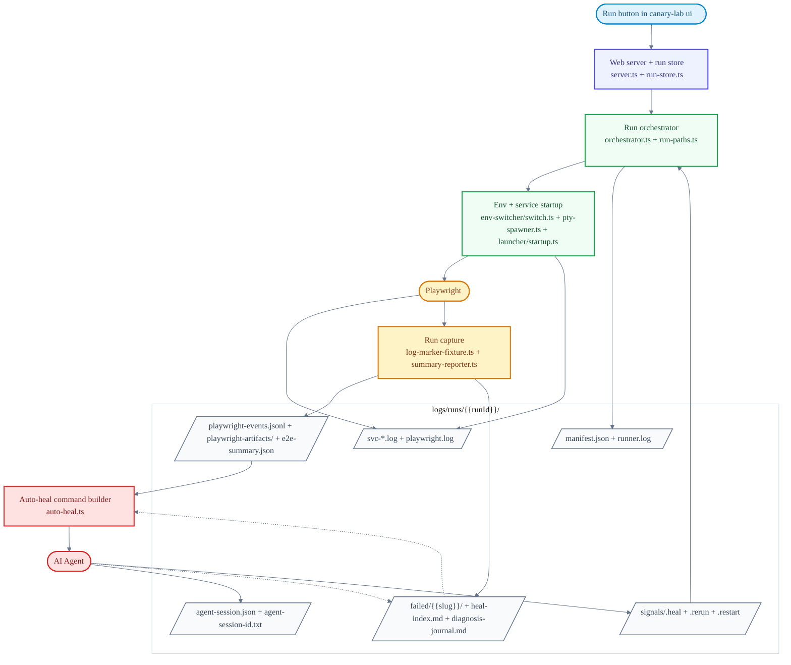

# Contributing to Canary Lab

Thanks for working on Canary Lab. This guide covers the repository layout, local
development, and the build and test workflow. For user-facing usage, see the
[README](../README.md). For deeper internal notes, see [AGENTS.md](../AGENTS.md).

## Code Orientation

- `server.ts`: local Fastify app, UI assets, routes, and WebSocket streams
- `orchestrator.ts`: service startup, health checks, Playwright runs, manifests, envset cleanup, and heal-loop signals
- `run-store.ts`: per-run manifests, summaries, Playwright events, and artifacts for the UI
- `env-switcher/switch.ts`: low-level env-file apply and revert logic
- `feature-support/`: public import surface for generated projects

Everything under `apps/`, `scripts/`, and `shared/` is internal unless exposed through `canary-lab/feature-support/...`.

## Run Architecture

This diagram shows the code path for a run started from `canary-lab ui`.



## Local Development

```bash
npm install
npm run build
```

## Repository Layout

- `scripts/`: CLI entry, scaffold/setup/upgrade commands, and MCP bridge
- `apps/web-server/`: local server, API routes, runtime orchestrator, run store, and PTY streams
- `apps/web/`: React UI
- `shared/e2e-runner/`: Playwright fixture support
- `shared/configs/`: base Playwright config and env loader
- `shared/runtime/`: shared project-root resolver
- `templates/project/`: scaffolded project files

The package exposes `canary-lab/feature-support/...` through `package.json` exports.

## Build and Test

```bash
npm run build
npm test
npm run smoke:pack
```

Use `npm run test:watch` during development and `npm run test:coverage` for coverage.
Typecheck with `npx tsc -p tsconfig.build.json --noEmit`.

`smoke:pack` builds, packs, scaffolds a temporary project, installs dependencies, and verifies the scaffold flow. Run it after changing templates or packaging.

## Pull Requests

Open a pull request against `main`.
