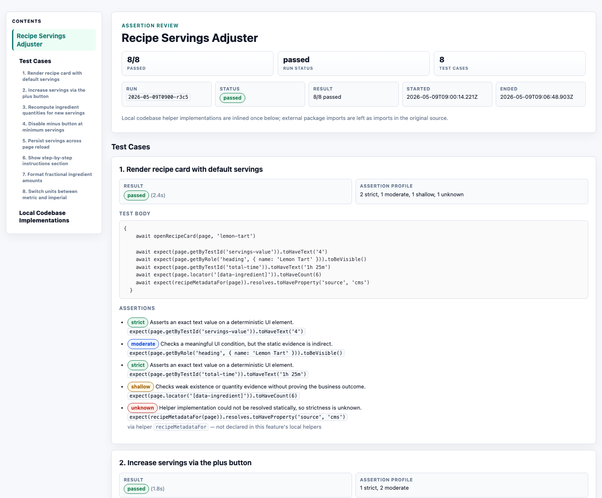

# Canary Lab Guide

Operational reference for environments, runs, repair, Flight, coverage, and
evaluation export. See the [README](../README.md) for installation and the main
workflow, and [FEATURES](FEATURES.md) for the suite-folder contract.

## Environment switching

An envset is a named collection of files applied for one suite environment.
Canary Lab backs up each configured target, writes the selected values before
the run, and restores the originals during teardown. Manage envsets in the UI;
their source files live under `features/<feature>/envsets/`.

Suite configuration can also make service startup environment-specific. A
typical suite starts local services for `local` and skips them for
`production`, where Playwright points at a deployed URL.

### Test a deployed URL

To run the same suite against a deployed environment without booting its local
services:

1. Add the environment to `feature.config.cjs`, for example
   `envs: ['local', 'production']`.
2. Add `envs: ['local']` to each local repository or `startCommand`.
3. Create a matching envset under `envsets/production/` with the remote target,
   for example `GATEWAY_URL=https://api.example.com`.
4. Make the tests read that value from `process.env.GATEWAY_URL`.
5. Choose **production** from the run's environment control.

The run applies the production envset, skips local-only commands, executes the
tests, and restores every configured target afterwards.

### Protect secrets

Envsets may contain credentials. The scaffold's `.gitignore` excludes
`features/*/envsets/*/*` by default. Review any envset file before force-adding
it to Git. The MCP env-capture tools return redacted key previews, not values.

## Run output

Each run has a durable directory under `logs/runs/<runId>/`. Files appear only
when that part of the lifecycle runs.

| Path | Evidence |
| --- | --- |
| `manifest.json` | Status, lifecycle, services, repository snapshots, ports, heal cycles, and artifact policy |
| `runner.log` | Orchestrator decisions and lifecycle narration |
| `svc-*.log` | Captured service output |
| `playwright.log` | Raw Playwright output |
| `playwright-events.jsonl` | Structured test and browser-action events |
| `playwright-artifacts/` | Current Playwright screenshots, videos, traces, and attachments |
| `playwright-artifacts-keep/` | Latest retained artifact set per test across repair reruns |
| `e2e-summary.json` | Current declared-test roster, verdicts, and failure context |
| `failed/<slug>/` | One compact evidence slice per failure |
| `heal-index.md` | Failure index and recommended reading order |
| `diagnosis-journal.md` | Repair hypotheses, changes, signals, and outcomes |
| `external-commands.jsonl` | Audited commands from an external repair session |
| `fixes/` | Captured repair patches and `fixes.json`, when available |
| `signals/` | Low-level `.heal`, `.rerun`, and `.restart` controls |

`logs/runs/index.json` is the run-history index. Run pages and MCP tools resolve
artifacts by run ID. Canary Lab does not automatically prune run evidence;
removal and artifact trimming are explicit actions under **Cleanup → Runs**.

## Report

Export a terminal run from its **Overview** tab. The archive contains
`evaluation.html` plus captured media, with each declared test's flow, source,
helpers, evidence, checks, and actual status. Failed, aborted, skipped, and
never-run cases keep those states; export never rounds them into passes.

When the suite has a PRD summary, the report separates two questions:

- **Mapped coverage:** tags map a test to every required path and variant.
- **Proven in this run:** the mapped test passed in the exported run.

Canary Lab never borrows a result from another run for an export.

The Export menu offers two wording modes:

- **Raw** renders directly from captured evidence and uses no LLM.
- **Localized** asks a local agent to improve each test's explanation.

Both modes preserve the same roster and verdicts. External MCP exports use
client-supplied wording; Canary Lab validates, stores, and renders it without
rewriting it again.



## Requirement coverage

Open **Coverage** from a suite row. The ledger computes claim-based coverage
from requirement, path, and variant tags. When a latest run exists, the shared
coverage service also computes a separate proven percentage and per-requirement
proof state for Flight and evaluation surfaces. The Coverage headline and gap
groups remain claim-based. Strictness describes the strongest assertion layer
in each test.

Regenerating the PRD summary preserves surviving requirement IDs. Changes to
source docs mark the summary and dependent coverage state stale instead of
silently reusing old mappings. See [FEATURES](FEATURES.md#requirement-coverage)
for the tag contract and [COMMANDS](COMMANDS.md#requirement-coverage-mcp-compact-or-direct-coveragelifecyclefull-profiles)
for MCP tools.

## Repair a failed run

When a normal run fails, Canary Lab either starts the configured local repair
agent or waits for an external client or manual signal. A repair continues the
same run so its evidence and journal remain one history.

Use `rerun` when the changed code can be exercised without restarting services.
Use `restart` after service, boot configuration, or environment changes.

### Where edits land

For a regular test run, Canary Lab attempts to create one Git worktree per
configured repository from `HEAD`, hydrate the user's uncommitted work, and link
the repository's existing `node_modules`. The repair agent normally edits these
per-run worktrees, not the user's checkout.

There are two important limits:

- If worktree creation fails for a non-portified repository, the run falls back
  to that repository in place and records a warning in `runner.log`. In that
  fallback, checkout isolation and automatic fix capture are not guaranteed.
- A portified repository never falls back in place. The run fails before boot
  if its worktree cannot be created, because the saved port overlay must not be
  applied to the user's checkout.

At teardown, Canary Lab diffs repair edits from successful worktree baselines
into `logs/runs/<runId>/fixes/`. Non-portified worktrees are normally removed.
Portified worktrees are kept after reversing the overlay because they may still
hold repair edits; manage them under **Cleanup → Worktrees**.

When a captured repair makes the run green and **Settings → GitHub → Open a
draft PR when a run heals green** is enabled, Canary Lab updates a fix branch
for the suite and product repository, then opens or updates a draft pull
request. A GitHub failure is recorded on the manifest and does not change the
test verdict. Red or abandoned repairs are never proposed.

### External repair

An interactive MCP client can own one repair claim. The normal loop is:

```text
start or claim run → wait for repair task → inspect focused evidence
→ edit app/service code → signal rerun or restart → wait again
```

Use `wait_for_heal_task` as the blocking status call. It heartbeats the claim and
returns `still_waiting`, `needs_heal`, `passed`, `failed`, or `boot_session`.
Use `get_heal_context` to refresh the compact failure packet and
`get_failure_detail` for one failure. Reserve `get_run_snapshot` for verbose
debugging; do not poll it.

Fix application or service code. Never delete, skip, weaken, or loosen a test to
turn the run green. Signal once per repair cycle, with the hypothesis and change
description, then wait on the same run again.

Setup-installed sessions intentionally expose one MCP tool: `exec`. Atomic names
such as `get_feature_coverage` are command values and do not appear as public
tools. If `exec` itself is missing, run `npx canary-lab setup --force`, reconnect
or restart the client, and start a fresh session. Tool discovery is session-scoped.

### Local auto-heal

Select **Claude** or **Codex** in Settings and a UI- or REST-started run launches
that local CLI in a PTY when repair is needed. The agent receives the active run
paths through `apps/web-server/prompts/heal-agent.md`.

Auto-heal stops when tests pass, the user stops the run, the agent exits without
a useful signal, a cycle times out, or no supported CLI is available. Runs
started through MCP use external-heal mode; the workspace's local-agent choice
does not take over that run.

### Manual signals

`signals/.rerun` and `signals/.restart` are the low-level controls used by the
UI, local agent, and external flow. They can also drive a custom integration.
`signals/.heal` is an internal repair trigger. Prefer the UI or MCP tools because
they also preserve claim ownership and journal metadata.

The hidden `manual` and `auto` heal-agent values remain valid in
`canary-lab.config.json`, the config API, and `handoff_heal` for existing
workspaces. `manual` waits for explicit signals; `auto` selects an available
local CLI.

## Models per stage

Every agent Canary Lab spawns itself — repo scan, doc collection, requirements
summary, test authoring, coverage mapping, auto-repair, parallel setup, report,
and commit message — can run on a chosen model and reasoning effort. Open
**Settings → Default agent → Configure models** to set the plan per agent (Claude and
Codex hold separate plans). **Agent default** passes no flags, so the CLI runs
on its own configuration; ✦ marks the shipped recommendation for each stage. A
custom model id is accepted verbatim for models the dropdown does not list.

The settings dialog probes the selected CLI and warns when it is missing or
signed out. The warning never blocks: choices still save and apply once the CLI
works.

**Ask at launch** (Settings → At launch) adds a per-launch checkpoint: starting
a flight, running a suite, or generating coverage first asks "use defaults or
customize?". A customized answer applies to that launch only and never changes
the saved defaults. Leave the setting on **Use defaults silently** (the
default) and nothing is ever asked.

The resolved plan is **locked when execution starts**: it is persisted on the
run, flight, or coverage record and cannot change mid-execution, so a
mid-flight settings edit applies to future launches only. Redoing a stage
re-resolves against current settings. Record surfaces (run overview, flight
summary, coverage progress) show the locked choices whenever any stage deviates
from agent default.

This applies to internal agents only. External MCP clients run on their own
model configuration, and `CANARY_LAB_HEAL_MODEL` (a server-wide demo pin) still
overrides the repair stage above all of it.

## Flight (`canary-lab flight`)

`npx canary-lab flight <repo...> "<what to test>"` takes one or more product
repositories through one server-owned pipeline:

```text
similarity → scout → scaffold → env capture → docs → PRD summary
→ Tests & coverage → Test run → Auto-repair → Report → Parallel setup
```

The serial Test run and downloadable Report finish before Parallel setup, so a
large app produces its evaluation without first waiting for port-injection
work. The Report is the end of the foreground journey: surface it as soon as it
exists. Parallel setup remains a persisted, server-owned final stage that can
finish, park, or be retried in the background without deleting the completed run
or Report. The Flight page continues to show its live progress.

The server owns stage priority, persistence, and every verdict. Judgment work can
come from two producers:

- **Internal** (default): Canary Lab spawns the selected local CLI for agentic
  stages.
- **External** (MCP only): `start_flight(..., stage_producer: "external")`
  parks on `external-work` handoffs. The connected client performs scout, docs,
  PRD summary, test authoring and mapping, the repair engagement, and a localized
  export. Canary Lab still re-reads artifacts and computes the verdict.

Mechanical work—scaffold writes, env application, Playwright execution, and raw
export—plus final Parallel setup stays in Canary Lab in both modes. Once
`links.evaluationZip` appears, an external client reports that path and ends its
turn; it does not keep polling while Parallel setup runs. An external client can
return any earlier handoff to the internal agent with `choice: "run-internally"`.
Flights persisted under the older client-owned Portify behavior use that same
choice to migrate their final handoff back to Canary Lab.

The Flight page remains live while an external client works. Its normal
mutations are disabled, but an `external-work` card offers **Request takeover**.
That records the request and waits; Canary starts its local agent only after the
external client stops and acknowledges with `choice: "run-internally"`. If the
client is gone, **Force takeover** is available behind a warning because Canary
cannot interrupt file writes already happening in another process.

The default coverage target is 100%. Portify proves injected-port readiness with
a concurrent double boot. Skipping it leaves the suite serial; it does not
make fixed ports safe for concurrent runs.

### Checkpoints and autopilot

Flight defines nine human-decision checkpoint kinds. External flights add a
tenth checkpoint kind, `external-work`, which is a work handoff rather than a
human approval.

Autopilot answers seven routine decisions by default and logs each answer as
`[autopilot]`:

| Checkpoint | Decision | Autopilot |
| --- | --- | --- |
| `similarity-choice` | Rerun, enhance, or create a new suite when one already matches | Always asks |
| `config-approval` | Accept the on-disk `feature.config.cjs` or re-scan | `approve` |
| `prd-source` | Continue with docs, collect repo docs, or infer from the branch diff | `continue` with docs; otherwise `collect-repo-docs` |
| `coverage-stuck` | Accept partial coverage or retry | `accept-partial` |
| `portify-gate` | Run or skip Parallel setup | `run` |
| `portify-apply` | Apply, revise, or cancel the verified overlay | `apply` |
| `run-failed` | Rerun or export the terminal non-green result | `export-as-is` |
| `export-mode` | Raw or localized evaluation wording | `raw` internally; `localized` externally |
| `missing-env` | Supply or waive unresolved secrets | Always asks, including with `--yolo` |

An automatically answered checkpoint that re-parks always reaches the user; it
is never auto-answered twice. Explicitly re-entering a stage also exposes that
stage's first checkpoint. Disable autopilot to answer every decision by passing
`autopilot: false` to `start_flight`.

Answer checkpoints from the terminal, Flight view, or
`respond_flight_checkpoint`. At `prd-source`, use `write_feature_doc` to add
Markdown content or link a local file before choosing `continue`.

### Resume, redo, and queue

One suite has one Flight record.

- Recalling an active Flight follows it.
- Recalling a paused Flight resumes its first open stage without deleting
  artifacts.
- `from_stage` re-enters one stage after checking prerequisites. It normally
  deletes that stage's and every later record stage's artifacts; re-entering
  Parallel setup deletes only its own Portify attempt and preserves the run and
  Report.
- `redo: true` restarts from stage one and deletes all stage artifacts. A full
  redo may replace the stored repos and description; omit them to reuse the old
  values.
- Plain resume and `from_stage` keep repos and intent frozen. Do not pass
  different values during those operations.

Queued Flights use `status: "paused"` with `pauseReason: "queued"` and start
automatically when the shared repositories become free. A user pause is
different: it stops live stage work and must not be resumed without the user's
request.

Deleting a Flight record is available only in the web UI. It removes Flight
history but keeps the suite and its files.

The web UI can split a broad description into several proposed suites. After
confirmation, the first Flight starts and siblings sharing the same repositories
queue. This planning surface is not available through the CLI or MCP.

## External authoring workflow

The default MCP surface is `compact`: one always-loaded `exec` tool dispatches
all 64 atomic commands, including Portify. Bare connections and `setup`-installed
clients use the same profile. Focused direct profiles, `lifecycle`, and `full`
remain opt-in surfaces for debugging and rollback.
A client can use the following standalone flow without asking Canary Lab to
author the content:

The names below are exact `command` values inside `exec.arguments`; for example,
`{"command":"create_feature","arguments":{...}}`.

1. `create_feature` writes the suite config, Playwright config, and envset
   skeleton.
2. `capture_feature_env_files` or `write_envset` adds environment files. Capture
   responses expose redacted key names only.
3. The client authors Playwright specs, then records and applies them through
   `start_external_draft` → `update_external_draft_stage` →
   `apply_external_draft`.
4. Call the coverage commands through `exec` to add source docs, submit structured
   requirements, map the tests, and read Canary Lab's computed ledger.
5. Run and repair locally through `exec`, or execute an observational deployed check.
6. Export a terminal run through `exec` with `start_external_evaluation_export` and
   `submit_external_evaluation_export`; its `archivePath` is the exact local zip
   to hand to the user (`evaluation.html` is inside it).

Use a leaf profile when a client needs only one part of the lifecycle. Use
`full` when the same connection also needs Portify. The UI stores these external
tasks and artifacts but does not reconstruct the external client's transcript.
